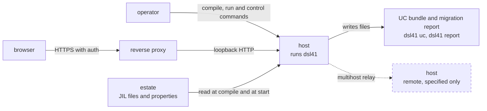
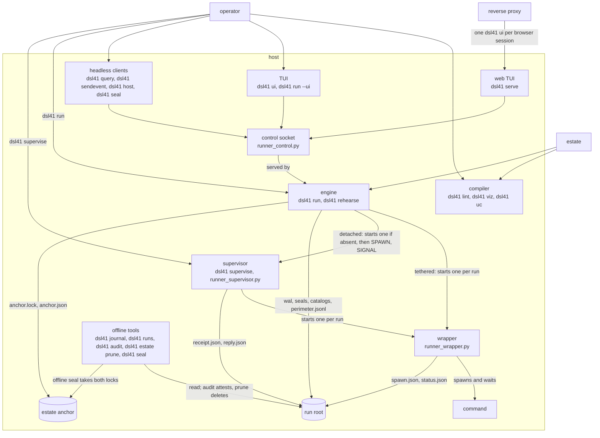
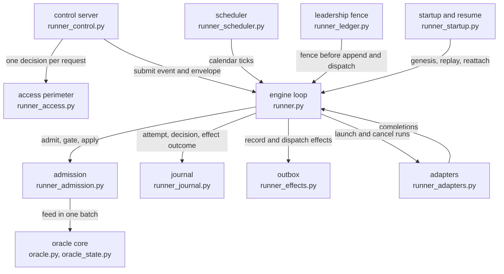
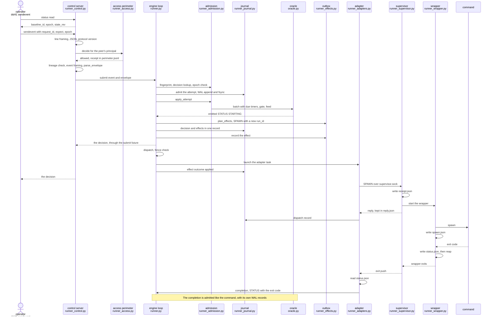

# Architecture overview

This page is a reader's map of dsl41. It holds no rules.
Each rule lives in the contract that the page links.
Read this page first, then read the [block cards](blocks/README.md) one at a
time.
The [glossary](glossary.md) defines the terms.
The [risk map](risk-map.md) shows where to look first.

Sections 2 to 4 follow the first three levels of the C4 model: context,
processes and stores, engine components. Section 5 follows one control
input end to end. Section 6 maps it all onto `examples/fulfilment`.

Every Mermaid node label and sequence participant names a module under
`src/dsl41/`, a `dsl41` CLI verb, or a process or actor from a short list.
`tests/test_architecture_doc.py` checks this.

## 1. Built and specified only

The sources are README's [Status](../README.md#status) and
[What is not built](../README.md#what-is-not-built), and the status lines of
the contracts.
A dashed node or edge in the diagrams below is specified only.

| Part | State | Source |
| --- | --- | --- |
| Compiler: parse, lower, derive, lint, graph, equivalence, UC twin, decompiler | built | README Status |
| Rich UC condition forms, the live OpenAPI pull, write-path verification, the generated client | specified only; needs a live controller | README What is not built |
| The decompiler's `--patterns` option | specified only | README What is not built |
| Engine, scheduler, admission, journal, outbox, control socket, access perimeter | built | [runner-design](runner-design.md) status line and [§14](runner-design.md#14-module-layout-and-phasing) |
| Supervisor and wrapper, the lifecycle tier | built | [runner-design §14](runner-design.md#14-module-layout-and-phasing) |
| TUI and web TUI | built | [runner-design §11](runner-design.md#11-ui--one-textual-app-terminal-and-web-e3) |
| Periods: seal, lineage anchor, audit, retention | built | README Status; [period-model](period-model.md) |
| Remote relay and shared store for more than one job host | specified only | [concurrency-model §7](concurrency-model.md#7-leadership-relay-takeover) |
| Authentication of a web session | outside dsl41: a reverse proxy or an ssh tunnel provides it | [runner-design §11](runner-design.md#11-ui--one-textual-app-terminal-and-web-e3); [access-model §9](access-model.md#9-the-web-tier) |

## 2. Context

dsl41 runs on one job host.
It reads an estate of JIL files.
It compiles the estate into reports and UC records, or it runs the estate
under AutoSys semantics.
An operator drives it from a shell on that host.
The web TUI listens on loopback by default. A browser reaches it through a
reverse proxy or an ssh tunnel
([deployment-runbook §4](deployment-runbook.md#4-ui-surfaces)).



The compiler pipeline is drawn in
[ir-design §1](ir-design.md#1-pipeline--representations).
The runner's place in that pipeline is
[runner-design §2](runner-design.md#2-position-in-the-pipeline).
The UC bundle is a file. dsl41 writes nothing to a live controller.

## 3. Containers

The operator starts the engine, and optionally the supervisor, with
`dsl41`. A detached engine starts a missing supervisor itself (DL-210).
The supervisor and the wrappers run by file path, not as a module of the package.
`dsl41 supervise start` and the engine both start the supervisor that way.
The runner keeps state in two stores: the [run root](glossary.md#run-root)
and the lineage [anchor](glossary.md#anchor).



- **Compiler.** The compile verbs read JIL and write reports, Mermaid,
  DSL source or a UC bundle. They hold no state between calls.
- **Engine.** `dsl41 run` is one asyncio process per run root. It owns
  the oracle, the WAL and the control socket. `dsl41 rehearse` runs the
  same engine on a virtual clock
  ([rehearse](glossary.md#rehearse)).
- **Control socket.** A Unix socket in the run root. It speaks JSON lines
  ([control-protocol §2](control-protocol.md#2-transport-and-framing-frozen)).
  Every client goes through it, even the TUI that `dsl41 run --ui` runs
  inside the engine's process.
- **Supervisor.** It keeps job processes alive across an engine restart.
  It runs only in [detached](glossary.md#detached) mode. Its socket
  protocol is
  [supervisor-protocol §5](supervisor-protocol.md#5-supervisor-socket-protocol-frozen--phase-11f-dl-48).
- **Wrapper.** One small process per job run. It is the direct parent of
  the command and writes the command's outcome to `status.json`
  ([wrapper](glossary.md#wrapper)). In [tethered](glossary.md#tethered)
  mode the engine starts it. In detached mode the supervisor starts it.
- **TUI and web TUI.** One Textual app, a client of the control socket.
  `dsl41 serve` starts one `dsl41 ui` per browser session and ships no
  authentication.
- **Run root and anchor.** The run root holds the WAL, the spool of each
  run, the seals, the catalogs and the perimeter journal. The anchor, a
  directory outside every run root, holds the estate's lineage. Their
  layout is [period-model §1.1](period-model.md#11-layout).

The service shape, with systemd units, owners and modes, is
[deployment-runbook §0, "Processes, units and storage"](deployment-runbook.md#processes-units-and-storage).
The identities that these stores carry (estate, period, segment, seal,
execution) are the
[period-model identity table](period-model.md#1-identities).

## 4. Engine components

The engine is a functional core inside an imperative shell
([runner-design §3](runner-design.md#3-architecture--functional-core-imperative-shell)).
The oracle is the core. It decides every status change.
The shell adds the clock, the processes, durability and the control
surface. It adds no semantics.



- **Engine loop.** One asyncio task. It is the only writer of the oracle
  ([runner-design §4](runner-design.md#4-engine-loop--single-writer)).
  Every input, from any source, goes through it.
- **Admission.** The one admission order for every input
  ([concurrency-model §4](concurrency-model.md#4-admission-and-application)).
  It answers an exact retry from the decision index by
  [request_id](glossary.md#request_id).
- **Oracle core.** The AutoSys semantics interpreter
  ([ir-design §7](ir-design.md#7-oracle-interface-semantics-interpreter)).
- **Scheduler.** It turns calendars into STARTJOB inputs
  ([runner-design §5](runner-design.md#5-scheduler--the-calendar-the-oracle-deliberately-lacks)).
- **Journal.** The WAL, one JSONL segment per [period](glossary.md#period),
  and its replay
  ([runner-design §7](runner-design.md#7-journal-and-recovery-e1-prod-grade)).
- **Outbox.** The effects the engine has decided and not yet finished
  ([outbox](glossary.md#outbox);
  [concurrency-model §5](concurrency-model.md#5-effects)).
- **Adapters.** One per job type. The command adapters run the wrapper,
  directly or through the supervisor
  ([runner-design §6](runner-design.md#6-adapters)).
- **Control server.** The socket server and its clients
  ([control-protocol](control-protocol.md)).
- **Access perimeter.** Off unless `dsl41 run --access-map` arms it. Then
  it gives each peer a tier and writes receipts to `perimeter.jsonl`
  ([perimeter](glossary.md#perimeter);
  [access-model §5](access-model.md#5-the-enforcement-point)).
- **Leadership fence and startup.** They take possession of a run root and
  the lineage, and prove both before each append and each dispatch
  ([concurrency-model §7](concurrency-model.md#7-leadership-relay-takeover);
  [period-model §1.3](period-model.md#13-the-successor-fence)).

## 5. One control input, end to end

This is `dsl41 sendevent FORCE_STARTJOB` for a command job, in detached
mode, with the access map armed.
The order is the code's. Arrows name the code's functions and files.



Where the real order differs from a simple list of hops:

- The client reads before it writes. `dsl41 sendevent` reads `status` to
  learn the baseline, the epoch and the revision for its `expect`, unless
  the operator gives them
  ([control-protocol §3](control-protocol.md#3-mutating-verbs-sendevent-host-seal)).
- The access gate runs before the control server routes the request
  ([access-model §5](access-model.md#5-the-enforcement-point)).
- The WAL takes two records per input. The attempt is appended before the
  oracle sees it. The decision and its planned effects are appended
  together after the oracle decides. So the outbox entry is durable before
  any effect runs.
- The answer is the decision. It does not wait for the job to start.
- The engine records the effect as applied when it launches the adapter
  task. That is before the supervisor receives SPAWN. For a SPAWN that
  fails, see [runner-design §3](runner-design.md#3-architecture--functional-core-imperative-shell).
- The supervisor answers SPAWN once the wrapper is started. The wrapper
  writes `spawn.json` a moment later, so these two steps can swap.
- In tethered mode there is no supervisor. The adapter starts the wrapper
  itself and waits on it.
- The completion is an input like any other. It takes the same admission
  order, with a stale-completion gate
  ([concurrency-model §4](concurrency-model.md#4-admission-and-application)).

The spool files are
[supervisor-protocol §3](supervisor-protocol.md#3-spool-format-frozen).
[SPAWN](glossary.md#spawn) idempotency across a supervisor restart is
[period-model §11a](period-model.md#11a-spawn-idempotency-that-outlives-the-supervisor).

## 6. The runnable example: `examples/fulfilment`

The example runs a synthetic warehouse wave under the real engine.
Its [README](../examples/fulfilment/README.md) is the authority for what
to run and what it proves.
It needs the Linux environment of
[examples/workflows](../examples/workflows/README.md) and a disposable
PostgreSQL database in `DATABASE_URL`.
From the repository root:

```sh
python examples/fulfilment/demo.py --run-dir /runs/fulfilment-drop
python examples/fulfilment/demo.py --no-incident --run-dir /runs/fulfilment-normal
```

What each container does in it:

| Container | In the example |
| --- | --- |
| estate | `estate.jil`: one box, `FF_WAVE_B`, and its command jobs. `demo.py` writes the properties that resolve `~{$WORKER}~` and `~{$PROFILE}~`. |
| engine | `demo.py` starts `python -m dsl41 run estate.jil --run-root <run>/engine -p <properties> --timezone UTC`. It runs tethered. |
| supervisor | Not started. The example has no `--detached`. |
| wrapper and command | The engine starts one wrapper per job run. The command is `worker.py`, which works on PostgreSQL and on the carrier. |
| control socket | `<run>/engine/control.sock`. `demo.py` sends `dsl41 sendevent STARTJOB` for the box and polls `dsl41 query status`. After the incident it sends one `FORCE_STARTJOB` for `FF_LABEL_2_C`. |
| run root | `<run>/engine`: the WAL, the spools and the logs. |
| offline reader | After the engine stops, `dsl41 runs --format json` supplies `runs.json`. `check.py` compares it with the worker's attempt rows. |

Two processes in the example are not dsl41: `carrier.py`, a local HTTP
service with a SQLite ledger, and PostgreSQL.
The README's "Operator recovery" section runs the same `query status` and
`sendevent FORCE_STARTJOB` by hand against a live engine.

## 7. Where to read next

- The block cards: [docs/blocks/README.md](blocks/README.md).
- The terms: [glossary](glossary.md).
- Coverage and open findings per machine: [risk map](risk-map.md).
- The runner's design: [runner-design](runner-design.md).
- The frozen runner contracts: [control-protocol](control-protocol.md),
  [supervisor-protocol](supervisor-protocol.md),
  [concurrency-model](concurrency-model.md), [period-model](period-model.md),
  [protocol-evolution](protocol-evolution.md), [access-model](access-model.md).
- The operator path: [deployment-runbook §0](deployment-runbook.md#0-the-operator-path).
- The decisions behind all of it: [decision index](decision-index.md).
