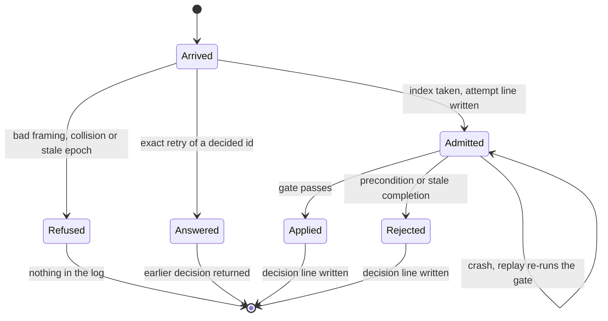

# Admission and idempotency

## Purpose

Every input takes one ordered path from arrival to a durable [decision](../glossary.md#decision).
That covers operator commands, host commands, calendar ticks, adapter completions, reconciliation injections and bare time observations.
The block tells a refusal from a rejection, answers an exact retry from the earlier decision, and leaves the records that make replay two-pass.

## Fate

The contract carries over: [concurrency-model §1](../concurrency-model.md#1-storage--frozen) names capabilities, not a file format.
Most of `runner_admission.py` carries over as it is: the envelope, the fingerprint, the frontiers and `apply_attempt` hold no storage.
`DecisionIndex` is the part that moves with the store. [Concurrency-model §1](../concurrency-model.md#1-storage--frozen) says decision lookup by `request_id` is the `DecisionIndex`, so a store that answers the lookup itself would replace or reduce it.
The writes and the rebuild in `runner_journal.py` would change too.
Storage capabilities needed:

- Decision lookup by `request_id`: step 2 calls `DecisionIndex.lookup`, an in-memory map that `read_decisions` rebuilds from the WAL.
- Atomic multi-record commit: `Journal.admit` writes the step-4 batch as one line, and `Journal.decision` writes the step-7 batch as one line.
- Epoch-conditional append: both writes go through `Journal._write`, which re-proves the leader lock before it appends.

Monotone epoch allocation is not listed. Step 2 compares the envelope's epoch with the leader's, which it reads and does not allocate; the stale-epoch refusal relies on allocation being monotone elsewhere.

## Interface

- `parse_envelope(request, addressed=..., baseline_id=...) -> Envelope` is the framing half of steps 1 and 2 for every external transport. It raises `EnvelopeError` naming the field.
- `addressed_key(kind, payload)` names the one entity a verb addresses, as a `job:` or `global:` key.
- `fingerprint(...)` hashes the envelope a retry must repeat. `at` is not in it.
- `Attempt` is one admitted input; `ApplyResult` is its decision; `Frontiers` holds `committed_index`, `applied_index` and the stamp frontier.
- `DecisionIndex.lookup(request_id, fingerprint)` returns the prior decision, `None`, or raises `RequestCollision` carrying the earlier decision.
- `apply_attempt(oracle, attempt, decided=..., grace_s=...) -> Applied` runs steps 5 to 7 for a live input and for a replayed one.
- `precondition_reason` checks [`expect`](../glossary.md#expect); `stale_reason` is the stale-completion gate.
- `Engine._admit_and_apply` in `runner.py` strings the steps together. `Engine.submit` and `Engine.submit_host` return an awaitable decision.
- WAL records: `input`, `host` or `advance` at step 4, and `decision` at step 7.
- On the wire, the four outcomes are those of [control-protocol §3](../control-protocol.md#3-mutating-verbs-sendevent-host-seal).

## States

One input's path:

## Invariants

- The steps and their order are [concurrency-model §4](../concurrency-model.md#4-admission-and-application)'s. This card does not restate them.
- Every external mutation names the revision it read. There is no opt-out, and `parse_envelope` is the one enforcement point ([concurrency-model §0](../concurrency-model.md#0-the-invariant); [DL-90](../decision-log.md)).
- A refusal leaves nothing in the log. A rejection is a decision at an index ([DL-90](../decision-log.md); [control-protocol §3](../control-protocol.md#3-mutating-verbs-sendevent-host-seal)).
- `expect` and `epoch` are in the fingerprint, so one verb at two revisions is two commands ([DL-90](../decision-log.md); [control-protocol §3](../control-protocol.md#3-mutating-verbs-sendevent-host-seal)).
- The epoch check comes after deduplication ([concurrency-model §4](../concurrency-model.md#4-admission-and-application) step 2; [DL-90](../decision-log.md)).
- A collision refusal carries the decision the id already holds ([DL-217](../decision-log.md)).
- The step-4 batch is one line ([DL-111](../decision-log.md)), and so is the step-7 batch ([DL-118](../decision-log.md)).
- A timer that fires inside an input's own batch does not invalidate its precondition. One due strictly earlier fires first and does ([concurrency-model §0](../concurrency-model.md#0-the-invariant); [DL-232](../decision-log.md)).
- The stale-completion gate judges only engine-made completions ([runner-design §4](../runner-design.md#4-engine-loop--single-writer); [DL-235](../decision-log.md)).
- A durable decision is never re-decided on replay; an admitted input with no decision is ([concurrency-model §4](../concurrency-model.md#4-admission-and-application), "Replay is two-pass").

## Failure and recovery

- Crash after step 4 and before step 7: replay applies the attempt through the gate ([concurrency-model §4](../concurrency-model.md#4-admission-and-application)). Its effects were never recorded. A command start it decided fails at resume, and a file watch starts again ([DL-102](../decision-log.md); `_resume_untraced_starts`).
- An id admitted but undecided at lookup raises `EngineError`, and the engine stops ([concurrency-model §4](../concurrency-model.md#4-admission-and-application) step 2).
- A stamp earlier than the frontier, or a decision out of index order, raises `EngineError` from `Frontiers`, and the engine stops.
- A replay whose revisions differ from the logged decision raises "replay diverged" from `apply_attempt`. A changed gate re-decides a crash-window attempt differently, which is why [DL-235](../decision-log.md) moved the state-machine version.
- A leader that lost its lock appends nothing: `Journal._write` refuses first ([concurrency-model §1](../concurrency-model.md#1-storage--frozen)).
- A caller with no decision after 5 s is told the outcome is unknown, and retries under the same id ([control-protocol §3](../control-protocol.md#3-mutating-verbs-sendevent-host-seal)).

## Owning modules

- `src/dsl41/runner_admission.py`: the envelope, the fingerprint, the decision index, the frontiers and `apply_attempt`.
- `src/dsl41/runner.py`: `Engine._admit_and_apply`, `Engine.submit`, `Engine.submit_host`, `Engine._refuse`.
- `src/dsl41/runner_journal.py`: `Journal.admit`, `Journal.decision`, `read_attempts`, `read_decisions`, `replay_inputs`.

## Tests

- `test_cm04_the_deadline_fires_before_the_gate_reads_the_status_it_gates_on`
- `test_cm05_an_exact_retry_takes_no_index_and_moves_no_time`
- `test_one_request_id_for_two_different_commands_is_refused_not_applied`
- `test_an_admitted_but_undecided_id_is_refused_rather_than_re_admitted`
- `test_results_out_of_order_are_refused`
- `test_admission_time_never_goes_backwards`
- `test_cm07_a_durably_rejected_attempt_is_not_applied_on_replay`
- `test_cm07_an_attempt_admitted_without_a_result_is_applied_through_the_gate`
- `test_cm07_the_time_half_of_a_rejected_attempt_still_applies`
- `test_a_log_this_build_derives_differently_from_is_refused`
- `test_an_unseen_stale_epoch_is_refused_where_a_retry_of_one_is_not`
- `test_a_mutation_that_names_no_revision_is_refused`
- `test_there_is_no_any_escape`
- `test_cm06_a_command_composed_against_a_stale_revision_is_rejected`
- `test_a_timer_inside_this_inputs_own_batch_does_not_invalidate_it`
- `test_a_refusal_leaves_nothing_in_the_log_and_a_rejection_leaves_a_decision`
- `test_a_collision_carries_the_ids_earlier_decision_applied_or_rejected`
- `test_the_stale_gate_rejects_a_completion_for_a_row_an_operator_set_inactive`

## Open findings

The [risk map](../risk-map.md) row "Admission and idempotency" lists none beyond the common one, [no transition inventory](../risk-map.md#no-transition-inventory).

## Gaps found

None.
