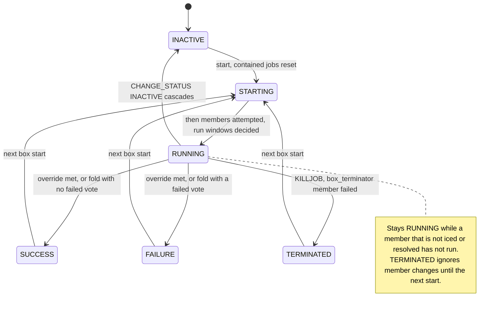

# Box execution

## Purpose

This block runs a BOX job and its members.
It starts members when the box runs, decides when the box completes and with which status, and applies the operator events that move a whole tree.
It lives inside the oracle; the engine dispatches nothing for a box ([runner-design §4](../runner-design.md#4-engine-loop--single-writer)).

## Fate

The code and its contract carry over unchanged if the storage under the runner changes.
It needs none of the storage capabilities.
Reason: a box's run state is two fields on its own `JobRuntime` row, `ran_members` and `window_skipped_members`, held in the same in-memory `RuntimeState` as every other row.
A live box has no effect and no execution entry ([period-model §3.5](../period-model.md#35-executions--a-discriminated-lifecycle-not-one-row)).

## Interface

- Inputs: the same `Oracle.feed` inputs as any job, aimed at a box or a member: STARTJOB, FORCE_STARTJOB, KILLJOB, STATUS, ON_NOEXEC, OFF_NOEXEC.
- Box row: `JobRuntime.ran_members` holds the members started in this run; `JobRuntime.window_skipped_members` holds the members resolved in it. `RuntimeState.start_run`, `record_resolution` and `void_resolution` write them.
- Oracle steps: `_reset_box_cycle`, `_on_box_started`, `_decide_windows_at_box_start`, `_on_member_transition`, `_on_descendant_transition`, `_apply_box_overrides`, `_all_members_done`, `_fold_box_default`, `_idle_box_recompute`, `_inject_inactive`, `_noexec_box`.
- Outputs: box STATUS events and trace lines. Member starts and kills reach the engine as the members' own events.

## States

The diagram leaves out the idle re-derivation edges between INACTIVE, SUCCESS and FAILURE.
[SEM-15](../autosys-semantics.md#sem-15--member-status-changes-can-ripple-upward-vc) holds their table.

## Invariants

- A box start resets every contained job that is not STARTING, RUNNING or QUE_WAIT, and nothing inside a live subbox, before its own STARTING transition ([SEM-10](../autosys-semantics.md#sem-10--box-membership-and-start-rule-v), [DL-242](../decision-log.md)).
- A member runs at most once per box run unless forced ([SEM-10](../autosys-semantics.md#sem-10--box-membership-and-start-rule-v), [SEM-23](../autosys-semantics.md#sem-23--force_startjob-vs-startjob-c)).
- The default fold waits for every member; a member that never starts hangs the box ([SEM-11](../autosys-semantics.md#sem-11--box-runningcompletion-v), [DL-13](../decision-log.md)).
- An operator's INACTIVE and a run_window skip resolve a member and run the full completion door ([DL-154](../decision-log.md), [DL-242](../decision-log.md)).
- A box start decides each waiting run_window member at once ([SEM-33](../autosys-semantics.md#sem-33--run_window-is-a-gate-not-a-trigger-v), [DL-246](../decision-log.md)).
- Override gating, with "inside" read transitively ([SEM-12](../autosys-semantics.md#sem-12--box_success--box_failure-override--with-evaluation-gating-v), [DL-12](../decision-log.md)).
- TERMINATED is sticky ([SEM-13](../autosys-semantics.md#sem-13--box-terminated-is-sticky-v)). Terminators cascade both ways ([SEM-14](../autosys-semantics.md#sem-14--box_terminator--job_terminator-vc)).
- An idle box re-derives with INACTIVE members ignored ([SEM-15](../autosys-semantics.md#sem-15--member-status-changes-can-ripple-upward-vc), [DL-242](../decision-log.md)).
- CHANGE_STATUS INACTIVE on a box cascades as one batch ([SEM-18](../autosys-semantics.md#sem-18--change_status-inactive-on-a-box-cascades-v), [DL-242](../decision-log.md)).
- ON_NOEXEC on a box: the dry run and the cascade ([SEM-22](../autosys-semantics.md#sem-22--on_noexec-v), [DL-254](../decision-log.md)).
- Unconsumed member arms die with the box run ([DL-54](../decision-log.md)).

## Failure and recovery

- A hung box is modeled behavior, not a fault. It stays RUNNING until an operator resolves the member, forces it or kills the box ([SEM-11](../autosys-semantics.md#sem-11--box-runningcompletion-v), [SEM-12](../autosys-semantics.md#sem-12--box_success--box_failure-override--with-evaluation-gating-v)).
- A queued member keeps the box RUNNING until it is admitted. A member queued in a box that stopped running is cancelled later ([DL-50](../decision-log.md), [DL-247](../decision-log.md)).
- A live member cascaded to INACTIVE gets no kill, and its later exit is rejected ([DL-235](../decision-log.md), [DL-242](../decision-log.md)).
- Box state replays with the rest of the oracle. A seal carries a live box on its row ([period-model §3.5](../period-model.md#35-executions--a-discriminated-lifecycle-not-one-row)).

## Owning modules

- `src/dsl41/oracle.py`: box start, folds, overrides, cascades.
- `src/dsl41/oracle_state.py`: the box row fields and their verbs.

## Tests

- `test_sem10_second_box_run_starts_only_the_head_of_a_plain_chain`
- `test_sem10_box_start_reset_leaves_a_live_member_running`
- `test_sem11_default_fold_all_success`
- `test_sem11_member_set_inactive_completes_a_running_box`
- `test_sem11_waiting_member_still_hangs_the_box`
- `test_sem12b_external_box_success_hung_running_then_fires_when_member_completes_after`
- `test_sem12c_box_success_over_a_grandchild_fires_transitively`
- `test_sem13_terminated_box_is_sticky_then_restarts_fresh`
- `test_sem14_terminator_cascade_both_directions`
- `test_sem15_single_member_table_follows_the_vendor_rule`
- `test_sem18_cascade_writes_every_row_before_it_wakes_anything`
- `test_sem22_noexec_box_goes_running_and_every_member_bypasses`
- `test_sem33_vendor_box1_started_at_0405_skips_joba_and_completes`
- `test_sem33_vendor_box1_started_at_1605_defers_joba_to_0200_next_day`
- `test_sem32_member_arm_dies_with_its_box_run`
- `test_dl50_queued_box_member_keeps_the_box_running_until_admitted`

## Open findings

See the row "Box execution" in [the risk map](../risk-map.md).
Every machine shares the [no transition inventory](../risk-map.md#no-transition-inventory) finding.

## Gaps found

- ON_ICE on a member that has not run, in a RUNNING box, does not re-run the completion check.
  `_all_members_done` skips an iced member, but the ON_ICE branch of `Oracle._handle_oob` only wakes referencers.
  The fold then waits for the next member transition.
  DL-154 records this as found and not fixed. SEM-20 says an iced job is removed from all logic.
