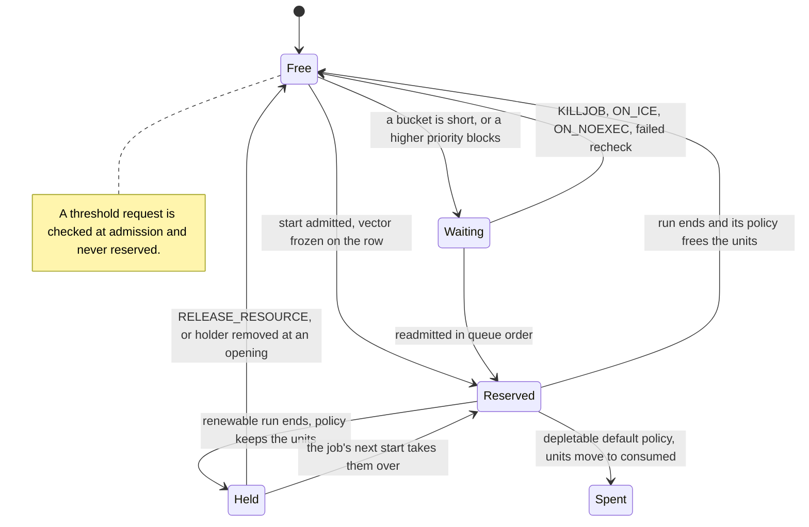

# Capacity waiter and reservation

## Purpose

This block models AutoSys machine load and virtual resources on one host ([runner-design §1](../runner-design.md#1-mission-and-scope)).
It decides whether a start may take its units now, queues it in QUE_WAIT if not, and readmits waiters in a fixed order.
It records which run holds which units, which units a job keeps after its run, and which units a depletable resource has spent.
No contract section is dedicated to it; the sources are cited below.

## Fate

The code and its contract carry over unchanged if the storage under the runner changes.
It needs none of the storage capabilities.
Reason: `CapacityPool` in `src/dsl41/capacity.py` holds no state. It is a pure function of the catalog, the rows and `consumed` ([DL-120](../decision-log.md)).
Reservations and waiter ranks ride on the job rows in the in-memory `RuntimeState`, so a seal carries them with the rows ([period-model §5](../period-model.md#5-capacity-decomposed)).

## Interface

- `CapacityPool(catalog, semantics)`: `demand_vector`, `used`, `can_admit`, `load_blocked`, `resource_blocked`, `has_priority_waiters`, `sorted_waiters`, `keeps_held`.
- Helpers in `capacity.py`: `checks_load`, `job_priority`, `release_policy`, `to_reservations`.
- Row fields: `JobRuntime.reservations`, a tuple of `CapacityReservation`, and `JobRuntime.waiter_seq`. Owner fields: `RuntimeState.consumed` and `enqueue_counter`.
- Owner verbs: `reserve`, `take_over_held`, `release_reservations`, `release_held`, `enqueue_waiter`, `dequeue_waiter`, `seed_consumed`.
- Oracle steps: `_start`, `_admissible`, `_acquire`, `_start_on_held`, `_enqueue_waiter`, `_wake_waiters`, `_readmit`, `_release_resource`, `_release_removed_holders`.
- Operator verb: RELEASE_RESOURCE ([control-protocol §3](../control-protocol.md#3-mutating-verbs-sendevent-host-seal)).
- Semantic switches: `renewable-free` and `queued-recheck` ([runner-design §8a](../runner-design.md#8a-semantic-switches)).

## States

One job's units on one bucket:

## Invariants

- An ordinary admission takes the whole demand vector or nothing ([DL-50](../decision-log.md)).
- Two exceptions come from [DL-256](../decision-log.md): a forced start of a FAILURE or TERMINATED holder runs on its held units plus its machine load, and a queued holder keeps its held units while it waits.
- Only a positive priority checks machine load, and every start holds its load ([DL-247](../decision-log.md)).
- A load waiter blocks lower priorities on its machine ([DL-247](../decision-log.md)). A resource waiter that passed its load check blocks lower priorities that name its resources ([DL-255](../decision-log.md)).
- Waiters readmit in a total order read off the rows ([DL-50](../decision-log.md), [DL-247](../decision-log.md)).
- The row-level capacity rules are in [period-model §5](../period-model.md#5-capacity-decomposed). `RuntimeState._check_capacity` checks the row invariants when each input commits; the verbs, such as `reserve` and `take_over_held`, enforce the rest.
- Usage is spent units plus units on rows; nothing stores the sum ([DL-120](../decision-log.md)).
- A renewable's unfreed units stay held by the job; a depletable's are spent ([DL-256](../decision-log.md)).
- What a job re-checks as it leaves the queue is a switch ([DL-257](../decision-log.md)).
- A holder's units are released before its referencers wake ([DL-50](../decision-log.md), amendment 1).
- QUE_WAIT belongs to this block; an operator never injects it ([DL-264](../decision-log.md)).
- How the dossier reads `job_load`, `priority` and `resources`: [autosys-semantics §5](../autosys-semantics.md#5-attributes-with-control-flow-teeth-quick-inventory).

## Failure and recovery

- The oracle sizes only buckets it can read. Preflight refuses an unsized resource, an unknown `res_type` and a demand that can never fit ([runner-design §8](../runner-design.md#8-preflight--refuse-loudly-run-honestly), [DL-50](../decision-log.md), [DL-247](../decision-log.md)).
- KILLJOB on a queued job dequeues and terminates it. ON_ICE dequeues it to INACTIVE ([DL-50](../decision-log.md)).
- A waiter that can never fit at runtime, such as one on a spent depletable, blocks lower priorities that name that resource. Preflight cannot see it ([DL-255](../decision-log.md)).
- Held units cross a seal on the row. A holder that the next catalog removes gives its units back at the opening ([period-model §5](../period-model.md#5-capacity-decomposed), [DL-256](../decision-log.md)).
- Recovery is replay of the inputs. The seal loader refuses capacity state that breaks the rules of [period-model §5](../period-model.md#5-capacity-decomposed).

## Owning modules

- `src/dsl41/capacity.py`: buckets, demand, blocking, queue order.
- `src/dsl41/oracle.py`: admission, release, readmission, RELEASE_RESOURCE.
- `src/dsl41/oracle_state.py`: `CapacityReservation`, the row fields, the verbs and the commit-time check.

## Tests

- `test_dl50_admission_never_overcommits_and_is_deadlock_free`
- `test_dl50_mutex_second_requester_queues_then_admits_on_release`
- `test_dl50_depletable_drains_and_never_refills`
- `test_dl50_killing_a_queued_job_removes_it_and_it_never_runs`
- `test_dl247_cheetah_jobc_first_keeps_both_queued_until_jobb_ends`
- `test_dl247_checked_starts_fit_and_respect_priority_blocking`
- `test_dl255_a_waiter_short_on_one_resource_blocks_on_every_resource_it_names`
- `test_dl255_starts_respect_resource_priority_blocking`
- `test_dl256_omitted_free_holds_after_failure_until_release_resource`
- `test_dl256_force_start_of_a_failed_holder_reuses_its_units`
- `test_dl256_held_units_never_overcommit_under_force_and_release`
- `test_dl256_held_units_cross_the_seal_until_release_resource`
- `test_dl256_a_row_that_is_not_live_may_carry_a_resources_held_units`
- `test_dl257_a_queued_job_whose_condition_went_false`
- `test_the_capacity_pool_never_changes_without_a_row_change`

## Open findings

See the row "Capacity waiter and reservation" in [the risk map](../risk-map.md).
Its own finding is [held-unit circular wait](../risk-map.md#held-unit-circular-wait).
Every machine shares the [no transition inventory](../risk-map.md#no-transition-inventory) finding.

## Gaps found

- A circular wait over held units can be built in one catalog with no operator act.
  - Resources X and Y are renewable, amount 1. Job a has priority 1 and requests (X, QUANTITY=1, FREE=N) AND (Y, QUANTITY=1, FREE=A). Job b has priority 2 and requests (Y, QUANTITY=1, FREE=Y).
  - Sequence: STARTJOB a, a ends FAILURE; STARTJOB b, b ends FAILURE; STARTJOB a; STARTJOB b.
  - Result, reproduced through `Oracle.feed`: a is QUE_WAIT holding r:X, and b is QUE_WAIT holding r:Y.
  - a cannot proceed: it is short on Y, which b holds. A holder that cannot be admitted queues and keeps its held units (`oracle.py:1822-1823`, DL-256 at `decision-log.md:16964-16968`).
  - b cannot proceed: its own held Y would fit, but a has a lower priority number, names Y and is short, so a blocks b (`oracle.py:1956`; `capacity.py:271-327`, with a's own units credited at `capacity.py:318`, DL-255).
  - Only RELEASE_RESOURCE, or KILLJOB followed by FORCE_STARTJOB, breaks the wait.
  - DL-256 accepts hold-and-wait, and DL-255 records a waiter that never fits; no DL entry records this cycle.
  - The claim of no hold-and-wait still stands in the module docstring of `oracle.py` (lines 224-225) and in the docstring of `test_dl50_admission_never_overcommits_and_is_deadlock_free` (`tests/test_resources.py:67-68`). That test checks liveness only for SUCCESS completions on one resource. No test checks liveness with held units.
- Two comments say reservations exist exactly while a row is live: the comment above `LIVE` in `oracle_state.py`, and the `_settle_row` docstring in `oracle.py`.
  Since DL-256 a row that is not live may keep held units (`may_outlive_run`).
- Period-model §5 says `sorted_waiters` "does an unguarded `self.catalog.jobs[j]`" and raises `KeyError`.
  The code uses `.get`.
  §5 names a documented default without stating it; the code's default sorts a missing job as an unset priority, behind every declared one (`capacity.py:374-387`).
- `release_policy` in `capacity.py` says a depletable never frees, as SEM-16 and DL-50 do.
  The code applies an explicit `FREE` code to a depletable too: one with `FREE=A` frees its units when its run completes, so they are never consumed.
  Preflight does not refuse that combination.
