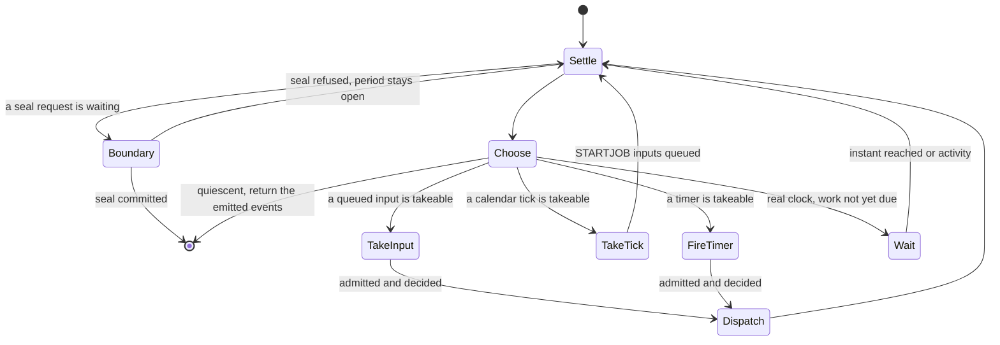

# Engine loop: the work choice

## Purpose

One asyncio task owns the oracle and runs the engine loop.
Each turn of the loop makes one choice: take a queued input, take a calendar tick, fire a timer, wait, or return.
`Engine._next_work` makes the choice and `Engine.run_until_quiescent` carries it out.
The choice decides order only; what an input does is the [admission](admission.md) block's work.

## Fate

The code and the contract carry over unchanged if the storage changes.
Storage capabilities needed: none.
Reason: `_next_work` reads the in-memory input queue, `oracle.next_timer_due()`, `scheduler.next_occurrence()` and the clock, and returns a `_Work` value; it writes nothing.
Every durable write happens after the choice, in admission, dispatch or the seal.

## Interface

- `Engine._next_work(horizon, now) -> _Work`. `_Work.do` is one of the five `_Do` names: `EVENT`, `TICK`, `TIMER`, `QUIESCE`, `WAIT`. `_Work.at` is the tick, the timer's stamp or the wake target.
- `Engine.run_until_quiescent(horizon) -> list[Event]` runs the loop and returns the events the oracle emitted.
- The queue is a heap of `_Pending` inputs ordered by `(at, arrival number)`. These fill it: `Engine.inject`, `Engine.submit`, `Engine.submit_host`, `Engine.inject_host`, `Engine.observe_opening`, scheduler ticks, adapter completions, reconciliation injections at resume (`_inject_completion`) and the seal's cutoff ticks (`Engine._cutoff`).
- `Engine._push` refuses an external request while a seal is running.
- `EVENT` and `TIMER` go through `Engine._admit_and_apply` and then `Engine._dispatch` (the [effect outbox](effect-outbox.md)).
- `TICK` waits for the tick and queues its `STARTJOB` inputs.
- `WAIT` blocks until the target instant or queue activity, then the loop chooses again.
- Two clock domains: a virtual clock jumps; a real clock sleeps and wakes early on activity.

## States

## Invariants

- One task owns the oracle, and nothing else writes it ([runner-design §4](../runner-design.md#4-engine-loop--single-writer)).
- A timer firing and a calendar tick are inputs. Each takes the one admission order ([concurrency-model §4](../concurrency-model.md#4-admission-and-application); ticks: [DL-45](../decision-log.md) item 2).
- The choice is one decision with a fixed priority: input, then tick, then timer. The truth table lives in the `_next_work` docstring; [DL-145](../decision-log.md) keeps its branch count as the domain's.
- On a real clock the loop commits to work only once its instant is due. An earlier instant is waited out, and an input that arrives during the wait makes the loop choose again ([DL-45](../decision-log.md) item 1).
- On a real clock a timer due strictly before a due queued input fires first, as its own input ([DL-232](../decision-log.md); [concurrency-model §0](../concurrency-model.md#0-the-invariant)).
- While `sealing` is set, `Engine._push` refuses new externally requested inputs and `_next_work` takes no tick. The seal itself drains the queue and admits the ticks due at or before its cutoff ([period-model §6](../period-model.md#6-the-cutoff-barrier) steps 2 and 4).
- Every admitted input ends in a dispatch pass ([DL-234](../decision-log.md)).
- Work at one clock instant has a budget. The floor is `INSTANT_BUDGET_FLOOR` ([DL-211](../decision-log.md)).

## Failure and recovery

- An adapter task that died with an exception is re-raised by `Engine._settle`, and the engine stops. Resume rebuilds the estate from the log ([period-model §11](../period-model.md#11-resume-replay-and-recovery)).
- A condition cycle that makes no progress at one instant raises `ZeroDelayCycleError` with the instant and the jobs it started ([DL-184](../decision-log.md)).
- A crash anywhere in the loop loses no choice: the choice is not durable. Resume replays the log and the new loop chooses afresh ([period-model §11](../period-model.md#11-resume-replay-and-recovery) steps 6 to 8).
- A real-clock adapter completion lands inside the horizon while the only known timer lies past it: the loop waits out the horizon instead of returning ([DL-45](../decision-log.md) item 12).

## Owning modules

- `src/dsl41/runner.py`: `Engine._next_work`, `Engine.run_until_quiescent`, `Engine._push`, `_Do`, `_Work`.
- Inputs to the choice come from `src/dsl41/runner_clock.py` (the clock) and `src/dsl41/runner_scheduler.py` (the ticks).

## Tests

- `test_dl137_row_e_a_queued_input_alone_is_the_event_row`
- `test_dl137_row_et_a_queued_input_wins_over_a_timer_due_inside_the_horizon`
- `test_dl137_row_s_a_calendar_tick_alone_is_the_tick_row`
- `test_dl137_row_st_a_calendar_tick_wins_over_a_timer_due_later`
- `test_dl137_a_tick_and_an_input_stamped_alike_feed_the_input_first`
- `test_dl137_row_none_the_real_domain_waits_for_an_input_not_yet_due`
- `test_dl137_row_none_the_real_domain_returns_when_all_work_is_beyond_the_horizon`
- `test_dl137_row_none_hold_open_waits_past_the_horizon_with_no_instant_known`
- `test_fast_real_completion_processed_before_a_far_later_term_run_time_timer`
- `test_a_deadline_due_before_a_late_decision_still_invalidates_a_stale_command`
- `test_a_timer_due_before_the_last_admitted_instant_is_stamped_at_that_instant`
- `test_horizon_discipline_time_only_moves_forward_across_calls`
- `test_zero_delay_cycle_raises_engine_error_instead_of_livelocking`

## Open findings

The [risk map](../risk-map.md) row "Engine work choice" lists none beyond the common one, [no transition inventory](../risk-map.md#no-transition-inventory).

## Gaps found

- DL-45 item 2 says a tick pops before any same-or-later-due timer or event commits. The code takes a queued input stamped at the same instant as a tick first: the tick row needs the tick strictly before the queue head. `test_dl137_a_tick_and_an_input_stamped_alike_feed_the_input_first` pins the code's order. A tick still goes before a timer due at the same instant.
- The code cites DL-137 for the five-way choice. DL-137 lists that fold as deferred. No entry records that it landed; DL-145 then lists the branch count as declined for change.
