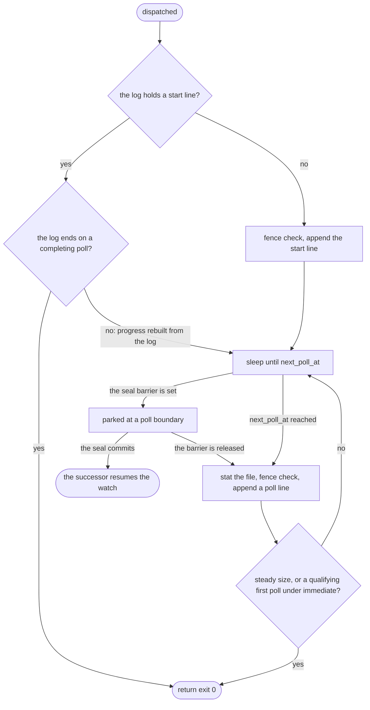

# FW observation

## Purpose

The FW adapter watches one file for one run of an FW job.
It completes the run with exit 0 once the file exists at its minimum size and its size is steady.
Its progress is evidence in an append-only log, so a restart, a [seal](../glossary.md#seal) and an audit all read the same watch.
An FW run is a watch inside the engine, not a process, in both lifecycle modes.
Its contract is [runner-design §6](../runner-design.md#6-adapters) and PR-34 in [period-model §13.6](../period-model.md#136-live-execution), as the risk map says; its rules are split across those, period-model §2.1 and §3.5, and DL-258.

## Fate

The adapter code and its rules carry over; the watch log is a run-directory file, not the ledger.
It needs two capabilities.
The leader fence, which the storage table lists as epoch-conditional append: `FileWatcherAdapter.run` calls `ctx.fence.check()` before every `watch.jsonl` line, so a deposed leader stops at its next line. The check and the append are two steps, not one conditional write.
Atomic multi-record commit, on the engine half: resume resolves a pending FW SPAWN by the `start` line that carries the effect's `run_id`, and that `run_id` is minted in the same `decision` record as the effect ([period-model §2.3](../period-model.md#23-decision--one-atomic-batch)), as for [SPAWN idempotency](spawn-idempotency.md).
The completion reaches the ledger as an ordinary STATUS input through the engine, not through this block.

## Interface

- `FileWatcherAdapter(default_interval_s=..., existence=...)` and its `run(job_ir, run_number, ctx)`, which returns 0.
- Job inputs: `watch_file`, `watch_interval` and `watch_file_min_size`. Estate inputs: the [runtime profile](../glossary.md#runtime-profile)'s `fw_default_interval_us` ([period-model §2.1](../period-model.md#21-segment--the-first-record-of-every-segment)) and the `fw-existence` switch (DL-258). `wire_from_profile` in `src/dsl41/runner_startup.py` builds the adapter from both.
- Context: `ctx.clock`, `ctx.run_root`, `ctx.run_id`, `ctx.fence` and `ctx.barrier`, filled by `Engine._run_adapter` in `src/dsl41/runner.py`.
- Spool: `runs/<job>.<run_number>/watch.jsonl`, one `start` line, then `poll` lines ([period-model §3.5](../period-model.md#35-executions--a-discriminated-lifecycle-not-one-row)).
- Readers: `read_watch_log`, which folds the log or a prefix of it into a `WatchLog`; `_resume_watch` in `runner_startup.py`; and `executions_at` in `src/dsl41/boundary.py`, which builds the seal's `FwWatch` entry.
- Without a run root, as in the virtual-domain harness, the watch keeps no spool.

## States

No machine is declared for the watch.
Its progress is a fold of `watch.jsonl`, and its parking is the seal's frozen phase in [seal_boundary](../state-machines.md#seal_boundary), not a step of the watch.
The flowchart shows one watch:

## Invariants

- Progress is evidence, not memory. The first line is `start`; then one fsynced line per poll, including polls that changed nothing ([runner-design §6](../runner-design.md#6-adapters); [period-model §3.5](../period-model.md#35-executions--a-discriminated-lifecycle-not-one-row); DL-129).
- Write-ahead per poll, under the fence: observe, re-check the fence, append and fsync, and only then move progress or complete (§3.5).
- `next_poll_at` is `start.at` after the start line and `poll.at + interval` after a poll line (runner-design §6; §3.5).
- A torn final line truncates on open (§3.5). A complete line that cannot be read refuses loudly (PR-08d in [period-model §13.2](../period-model.md#132-canonical-form); `read_watch_log`).
- A resumed watch appends no second `start`. A `start` line naming the effect's `run_id` resolves a pending FW SPAWN as applied (§3.5; DL-129).
- When an effect bound a `run_id`, every line names it, and a log naming another run is refused (DL-129). A launch with no bound effect, as from a pre-DL-118 journal, writes a null `run_id`.
- The seal barrier parks every FW task at a poll boundary before T. The seal's `fw_watch` entry is a fold of the first `watch_seq` lines (§3.5).
- Completion: `stable`, the default, needs two steady qualifying polls. `immediate` completes on the run's first poll only, and only for a job with no minimum size (DL-258).
- The interval is the job's `watch_interval`, else the profile's `fw_default_interval_us` (§2.1). Adapters never retry and never time out (the module docstring of `runner_adapters.py`).
- The wiring rounds the microsecond profile interval to whole seconds, at least one. No shipped surface sets a value that is not whole seconds; resume refuses a hand-pinned one as profile drift. `profile_field:fw_default_interval_us#rounding` in [simulation-coverage](../simulation-coverage.md#profile_field) keeps it provisional.

## Failure and recovery

- The engine dies after the `start` line and before `effect_result{applied}`. Resume resolves the pending SPAWN by the line and rebuilds the watch from the log (PR-34a in [period-model §13.6](../period-model.md#136-live-execution)).
- The engine dies after a completing poll and before the STATUS input is durable. `_resume_watch` injects the completion from the log (PR-34a).
- A run directory exists with no `start` line. Resume dispatches the watch again under the bound `run_id`.
- Leadership is lost. The fence check raises before the append, so no line lands (PR-03, cited in §3.5).
- A seal aborts. The barrier is released and the parked poll proceeds (PR-28b).
- A seal [fail-stops](../glossary.md#fail-stop). No abort runs, so the barrier is not released, and the engine stops. After a fence loss or one of [DL-274](../decision-log.md)'s cases, resume rebuilds from the WAL with the period still open. After a failure at or after the `seal` append, the outcome is unknown and recovery decides ([period-model §7](../period-model.md#7-the-seal-operation), PR-28d).
- A log that cannot be read, or that names another run, stops the engine with an error. It is never read as "not dispatched".
- A resume whose catalog has an FW run and no FW adapter wired refuses.

## Owning modules

- `src/dsl41/runner_adapters.py`: `FileWatcherAdapter`, `WatchLog`, `read_watch_log`, `append_watch_line`, `SealBarrier` and `AdapterContext`.
- `src/dsl41/runner.py`: the context it passes, the barrier park and release, and the default interval for the seal's executions.
- `src/dsl41/runner_startup.py`: adapter wiring from the profile, profile derivation from the wired adapter, and `_resume_watch`.
- `src/dsl41/boundary.py`: `executions_at`, which folds the log for a seal.

## Tests

- The log: `test_pr34_the_start_line_is_the_first_durable_act_and_carries_the_effects_run_id`, `test_pr34_a_line_lands_for_every_poll_including_the_ones_that_changed_nothing`, `test_pr34_next_poll_at_is_start_at_then_poll_at_plus_interval`, `test_pr34_a_torn_final_line_truncates_on_open`, `test_pr34_a_complete_line_this_binary_cannot_read_is_refused_not_truncated`, `test_pr34_an_unversioned_line_is_unsupported_evidence`.
- Identity: `test_pr34_a_poll_naming_another_run_never_completes_the_watch`, `test_pr34_a_recorded_count_the_observations_cannot_derive_refuses`, `test_pr34_the_adapter_refuses_to_adopt_a_strangers_watch`.
- Resume: `test_pr34_a_start_line_resolves_a_pending_spawn`, `test_pr34_a_restart_between_the_two_qualifying_polls_completes_the_same_watch`, `test_pr34a_a_completing_poll_then_a_crash_injects_the_completion_from_the_log`, `test_dl258_an_immediate_qualifying_poll_then_a_crash_injects_from_the_log`, `test_pr34_a_run_directory_with_no_log_is_re_dispatched_under_the_bound_id`, `test_m4_resume_refuses_incomplete_fw_without_adapter`.
- Fence and seal: `test_pr03_the_fw_append_re_proves_the_anchor_fence`, `test_pr34_the_barrier_parks_every_fw_task_at_a_poll_boundary`, `test_pr28b_an_abort_unparks_the_watch`, `test_the_watch_fold_takes_a_positional_prefix_and_never_reads_past_it`, `test_b1_the_boundary_commits_over_a_night_in_flight`.
- Completion rule: `test_fw_two_immediately_stable_polls_succeed`, `test_fw_existence_with_the_file_already_present`, `test_fw_existence_with_the_file_appearing_later`, `test_fw_existence_does_not_change_a_job_with_a_minimum_size`, `test_fw_existence_is_derived_from_the_wired_adapter_not_the_pin`.

## Open findings

See the row "FW observation" in [the risk map](../risk-map.md).
The map ranks it fifth among the [least-tested machines](../risk-map.md#least-tested-machines), with `runner_adapters.py` as its weakest module.
All four owning modules are in the 100% gate ([DL-299](../risk-map.md#closed-by-dl-289dl-306)), and the row lists no open finding.

## Gaps found

None.
