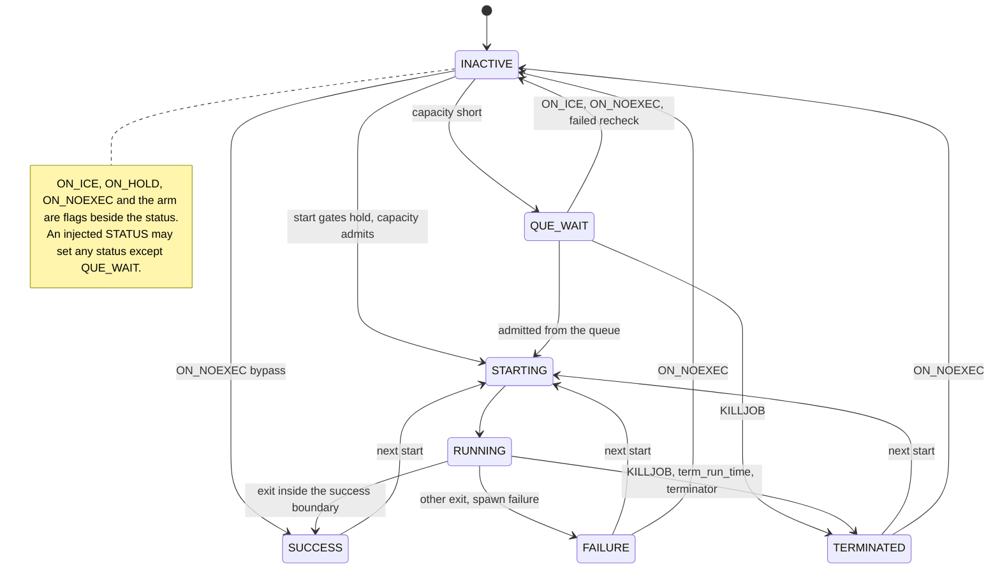

# Job lifecycle and flags

## Purpose

This block is the state machine of one job: its status, its three operator flags and its schedule arm.
It decides when a job may start and what a completion or an operator event does to it.
It is the pure core that the engine feeds and acts on ([runner-design §3](../runner-design.md#3-architecture--functional-core-imperative-shell)).

## Fate

The code and its contract carry over unchanged if the storage under the runner changes.
It needs none of the storage capabilities.
Reason: `src/dsl41/oracle.py` and `src/dsl41/oracle_state.py` import no journal or store module.
`RuntimeState` keeps the rows in private in-memory maps, and replaying the inputs rebuilds them.
Its per-input [state_rev](../glossary.md#state_rev) is what a store's conditional write would read ([concurrency-model §3](../concurrency-model.md#3-state-ownership-and-state_rev)).

## Interface

- Inputs: `Oracle.feed(event)`, `Oracle.batch(at)` for several events at one instant, and `Oracle.advance(now)` for a bare time observation. The alphabet is `EventKind` in `oracle_state.py`.
- Outputs: emitted events, of which a STATUS STARTING is the shell's dispatch instruction; the trace of `TraceEntry` lines; `Oracle.next_timer_due()`.
- State: one frozen `JobRuntime` row per job, written only by `RuntimeState` verbs such as `transition`, `start_run`, `set_flags` and `set_armed`.
- Status sets: `TERMINAL`, `LIVE` and `INJECTABLE_STATUSES` in `oracle_state.py`.
- Condition truth: `Oracle._cond_true` over the tree that `conditions.py` parses.

## States

## Invariants

- A job starts only when all its start gates hold ([autosys-semantics §0](../autosys-semantics.md#0-execution-model-the-frame-everything-else-hangs-on)). FORCE_STARTJOB bypasses a named subset ([SEM-23](../autosys-semantics.md#sem-23--force_startjob-vs-startjob-c), [DL-13](../decision-log.md)), and clears ON_ICE or ON_HOLD on a job that is not live first ([DL-243](../decision-log.md)).
- Conditions are latching predicates, re-evaluated on edges ([SEM-01](../autosys-semantics.md#sem-01--conditions-are-latching-state-predicates-not-edges-v), [DL-13](../decision-log.md)).
- The oracle classifies an exit code; an adapter never does ([SEM-09](../autosys-semantics.md#sem-09--max_exit_success-shifts-successfailure-boundary-v), [runner-design §3](../runner-design.md#3-architecture--functional-core-imperative-shell)).
- A scheduled tick blocked at a releasable gate arms the job; an actual start consumes the arm ([SEM-32](../autosys-semantics.md#sem-32--start_times--start_mins-v), [DL-54](../decision-log.md)). An arm crosses a seal ([period-model §10.4](../period-model.md#104-armed-latches-cross-a-release)).
- ON_ICE, ON_HOLD and ON_NOEXEC are ignored where the vendor says so, with one `EVENT_IGNORED` trace line ([DL-254](../decision-log.md)).
- ON_NOEXEC on a FAILURE or TERMINATED job is a stored move to INACTIVE ([SEM-22](../autosys-semantics.md#sem-22--on_noexec-v), [DL-243](../decision-log.md)).
- An operator never injects QUE_WAIT; the control server refuses it before the journal append ([DL-264](../decision-log.md)).
- Rows change only through the owner's verbs ([DL-86](../decision-log.md)). One input moves each changed row's revision once ([DL-87](../decision-log.md)).

## Failure and recovery

- A malformed input raises `OracleError`: an unknown status, a STATUS with neither a status nor an integer exit code, a job verb without a job.
- The shell's stale-completion gate, not the oracle, rejects a completion for a run that is no longer live ([runner-design §4](../runner-design.md#4-engine-loop--single-writer), [DL-235](../decision-log.md)). The oracle lets an injected STATUS overwrite a terminal status, as CHANGE_STATUS does ([DL-13](../decision-log.md)).
- An injected INACTIVE on a launched run plans no kill. The run becomes an orphan whose later exit the gate rejects ([DL-235](../decision-log.md)).
- Recovery is replay of the journaled inputs in order ([runner-design §7](../runner-design.md#7-journal-and-recovery-e1-prod-grade), [period-model §11](../period-model.md#11-resume-replay-and-recovery)). A log written under another state-machine version is refused ([DL-235](../decision-log.md)).

## Owning modules

- `src/dsl41/oracle.py`: start gates, out-of-band events, completions, timers.
- `src/dsl41/oracle_state.py`: rows, verbs, timer heap, input transaction.
- `src/dsl41/conditions.py`: the condition tree and its comparisons.

## Tests

[autosys-semantics §8](../autosys-semantics.md#8-trace-test-index-oracle-regression-set-one-per-sem-unless-noted) maps each SEM entry to its trace tests. A sample:

- `test_sem01_latching_across_days_survives_hold_and_an_unrelated_clock_advance`
- `test_sem02_atom_n_false_while_running_true_after_terminal`
- `test_sem09_max_exit_success_shifts_the_success_failure_boundary`
- `test_sem20_on_ice_on_a_live_job_is_ignored`
- `test_sem20b_off_ice_does_not_immediately_run_but_fires_when_condition_reoccurs`
- `test_sem21b_off_hold_runs_immediately_if_conditions_already_satisfied`
- `test_sem22_noexec_on_a_failed_job_transitions_to_inactive`
- `test_sem22_on_noexec_on_a_queued_job_takes_it_out_of_the_queue`
- `test_sem23_force_start_clears_ice_and_runs`
- `test_sem24a_initial_on_hold_blocks_then_off_hold_releases`
- `test_sem32_scheduled_startjob_with_false_condition_arms_and_waits`
- `test_dl264_everything_framing_accepts_applies_to_the_oracle`
- `test_cm02_one_input_that_changes_many_things_increments_each_entity_once`
- `test_stale_completion_gate_run_number_mismatch_and_already_terminal`
- `test_hypothesis_feed_only_vs_advance_interleaved_traces_identical`

## Open findings

See the row "Job lifecycle and flags" in [the risk map](../risk-map.md).
Its own finding is [owning modules outside the 100% gate](../risk-map.md#owning-modules-outside-the-100-gate), for `conditions.py`.
Every machine shares the [no transition inventory](../risk-map.md#no-transition-inventory) finding.

## Gaps found

- An injected STATUS still moves a job that is ON_NOEXEC: `Oracle._handle_status` has no flag check.
  The vendor says CHANGE_STATUS has no effect on an ON_NOEXEC job, and a box CHANGE_STATUS INACTIVE leaves ON_NOEXEC members' status alone.
  [SEM-22](../autosys-semantics.md#sem-22--on_noexec-v) records both rules in a not-modeled note that points at [DL-254](../decision-log.md).
  It also marks the inherited bypass, a member bypassing under a flagged box, as a project pin with no vendor source, and names the corners it decides.
  Whether the oracle should follow the vendor rules is the owner's decision; DL-254 deferred it.
