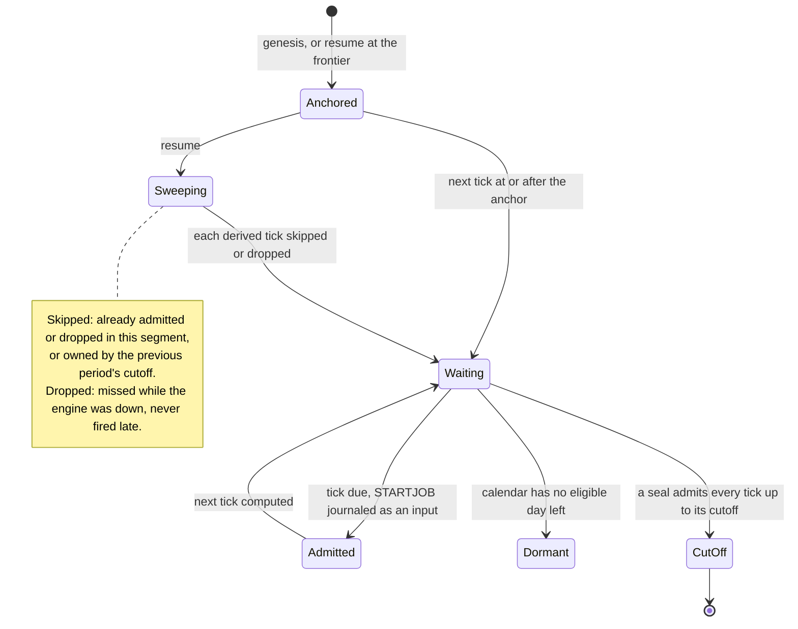

# Scheduler and timer frontier

## Purpose

This block turns each scheduled job's calendar into STARTJOB inputs at its ticks.
The oracle owns no calendar ([runner-design §5](../runner-design.md#5-scheduler--the-calendar-the-oracle-deliberately-lacks)).
It also keeps the [scheduler frontier](../glossary.md#scheduler-frontier): the evidence of which ticks a segment already admitted or dropped.
With it, a resume or a [seal](../glossary.md#seal) neither fires a tick twice nor loses one without a record.

## Fate

`Scheduler` and `autocal.py` carry over unchanged and need none of the storage capabilities.
They compute ticks from the catalog and an anchor and import no storage module.
The frontier needs epoch-conditional append, the leader fence of [concurrency-model §1](../concurrency-model.md#1-storage--frozen).
Its guarantees of no double fire and no duplicate drop (DL-166, DL-174) assume that one writer adjudicates a segment's ticks.
Two engines that both ran the resume sweep in `runner_startup.py` would each append a `drop` for the same tick, or each admit it.
The fence is enforced in `Journal._write` in `runner_journal.py`, which checks the leader lock before each append when a lock is wired.
Its rules carry over to a store that returns a segment's records in order, because `scheduler_frontier` reads record kinds and stamps, not files.

## Interface

- `Scheduler(catalog, start=, default_tz=, tz_aliases=, semantics=)` in `runner_scheduler.py`: `next_occurrence()`, `pop_due(upto)`, `reset(start)`, `upcoming()`. `pop_due` returns STARTJOB events stamped at their ticks.
- Engine, in `runner.py`: the loop wakes at the earliest of the oracle's timers, the next tick, the clock's sleepers and the queue head ([runner-design §4](../runner-design.md#4-engine-loop--single-writer)). A due tick is enqueued with `source="scheduler"`. `Engine._cutoff(at)` admits every tick at or before a seal's cutoff.
- Resume, in `runner_startup.py`: re-anchor at `scheduler_frontier(records)`, sweep the ticks up to now, and record each missed one with `journal.drop`.
- Clocks, in `runner_clock.py`: the `Clock` protocol, `RealClock` on naive UTC, and `VirtualClock` ([runner-design §9](../runner-design.md#9-time-domains-e2)).
- Calendars: `compile_calendar`, `CompiledCalendar` and `standard_rows` from `autocal.py`. Start instants: `start_time_instants` and `start_mins_instants` from `timezones.py`.
- Oracle timers: `Oracle.next_timer_due()` and `Oracle.advance(now)` ([runner-design §3](../runner-design.md#3-architecture--functional-core-imperative-shell)).

## States

One job's schedule plan:

## Invariants

- The scheduler fires at the tick without checking conditions; arm-and-wait and `run_window` stay in the oracle ([runner-design §5](../runner-design.md#5-scheduler--the-calendar-the-oracle-deliberately-lacks), [DL-45](../decision-log.md)).
- A tick is an input: stamped at the tick and journaled before it is fed ([DL-45](../decision-log.md)).
- A stalled live engine fires its backlog. Ticks missed across downtime are dropped and journaled, never fired late (E9 in [runner-design §15](../runner-design.md#15-open-questions-e-series)).
- The resume anchor is inclusive. The sweep skips a tick this segment adjudicated or the previous cutoff owned ([DL-166](../decision-log.md), [DL-174](../decision-log.md)).
- Which records count toward the frontier, and how ticks split at a seal: [period-model §6](../period-model.md#6-the-cutoff-barrier).
- Calendar days are read on the job's local day. An exhausted calendar makes the job dormant, not an error ([DL-56](../decision-log.md), [DL-57](../decision-log.md)).
- A job without a `timezone` uses the base zone ([DL-155](../decision-log.md)). Start times on a DST change follow `dst-start-times`, and the engine refuses a scheduler on another value ([DL-260](../decision-log.md)).
- Feeding timers through `advance` gives the same trace as feeding them through `feed` ([runner-design §3](../runner-design.md#3-architecture--functional-core-imperative-shell)).

## Failure and recovery

- An unresolvable timezone or a calendar that cannot be read raises `EngineError` when the scheduler is built. Preflight refuses both before a run ([runner-design §8](../runner-design.md#8-preflight--refuse-loudly-run-honestly)).
- An extended calendar the interpreter cannot read is refused loudly. Materializing it to a standard calendar is the workaround ([DL-57](../decision-log.md)).
- After a crash, resume re-derives from the frontier and drops what it missed, once per tick ([DL-174](../decision-log.md)). A crash between two same-instant ticks leaves one unjournaled; the inclusive anchor finds it and drops it ([DL-45](../decision-log.md), [DL-166](../decision-log.md)).
- During a seal, tick admission is frozen and the cutoff admits every tick through its instant ([period-model §6](../period-model.md#6-the-cutoff-barrier)).
- Open: whether the vendor fires or skips a tick missed during an outage (E9), and absent `days_of_week` read as every day (E10) ([runner-design §15](../runner-design.md#15-open-questions-e-series)).

## Owning modules

- `src/dsl41/runner_scheduler.py`: schedule plans, ticks, dormancy.
- `src/dsl41/runner.py`: tick admission in the engine loop, the cutoff.
- `src/dsl41/runner_clock.py`: the real and virtual clocks.
- `src/dsl41/runner_startup.py`: the resume sweep.
- `src/dsl41/runner_journal.py`: `scheduler_frontier`.
- `src/dsl41/autocal.py`: extended calendar interpretation.

## Tests

The calendar rules are pinned by the `test_sem36_*` to `test_sem39_*` families. A sample of the rest:

- `test_days_of_week_filters_to_weekdays_only`
- `test_multiple_jobs_due_at_once_sorted_by_tick_then_job`
- `test_backlog_fires_every_intermediate_tick_stamped_at_its_own_time`
- `test_first_tick_counts_at_the_anchor_and_consuming_it_advances`
- `test_exhausted_run_calendar_leaves_the_job_dormant`
- `test_scheduler_run_calendar_without_start_times_fires_at_row_times`
- `test_scheduler_honors_extended_calendar_rules`
- `test_default_tz_applies_to_jobs_without_their_own_timezone`
- `test_sem32_dst_spring_missing_hour_start_time_runs_in_the_first_minute_of_0300`
- `test_sem32_dst_the_engine_refuses_a_scheduler_on_another_switch_value`
- `test_resume_real_domain_missed_ticks_are_dropped_and_journaled`
- `test_resume_virtual_scheduler_ticks_never_refire`
- `test_dl45_a_same_instant_sibling_lost_to_the_crash_is_dropped_not_forgotten`
- `test_dl166_a_tick_this_segment_admitted_after_t_is_skipped_without_a_drop`
- `test_dl174_a_tick_at_a_drop_frontier_is_dropped_once_across_three_resumes`
- `test_pr25_the_next_period_starts_its_scheduler_strictly_after_t`
- `test_hypothesis_feed_only_vs_advance_interleaved_traces_identical`

## Open findings

See the row "Scheduler and timer frontier" in [the risk map](../risk-map.md).
Its own finding is [owning modules outside the 100% gate](../risk-map.md#owning-modules-outside-the-100-gate), for `runner_clock.py`.
Every machine shares the [no transition inventory](../risk-map.md#no-transition-inventory) finding.

## Gaps found

- The docstring of `Scheduler.pop_due` says ticks missed across downtime "never reach this path".
  The resume sweep in `runner_startup.py` derives them through `pop_due` and then drops them.
  A comment there says `pop_due` "is the only source of both an admitted and a dropped tick".
