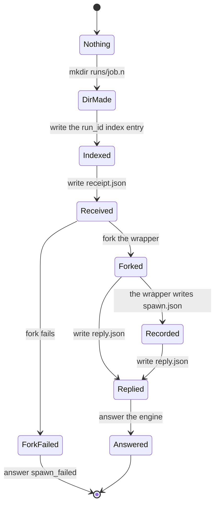

# SPAWN idempotency

## Purpose

A replayed [SPAWN](../glossary.md#spawn) must never start a second process.
The key is the `run_id` the engine mints with the SPAWN effect.
The store is the run directory and three supervisor records, not memory, so idempotency outlives `LIST` eviction and a supervisor restart.

## Fate

The supervisor half carries over unchanged and needs none of the storage capabilities.
Reason: `Supervisor._resolve_replay` reads only files under the run root (the index, the run directory's records) and its own in-memory run table.
The engine half needs atomic multi-record commit.
Reason: the SPAWN effect and its `run_id` are minted in one `decision` record, and resume replays that effect rather than minting again (`AdapterContext.run_id`; [period-model §2.3](../period-model.md#23-decision--one-atomic-batch)).
It carries over to any store that keeps that capability.

## Interface

- Wire: `SPAWN {incarnation, token, spec}`, where `spec` is the frozen wrapper input spec ([supervisor-protocol §2](../supervisor-protocol.md#2-wrapper-input-spec-frozen)).
- Answers: the first result `{ok, run_id, wrapper_pid, spawned_at}`, the frozen duplicate envelope, or a refusal: `bad_run_id`, `bad_spec`, `collision`, `in_progress`, `indeterminate` or `spawn_failed: <reason>` ([§5](../supervisor-protocol.md#5-supervisor-socket-protocol-frozen--phase-11f-dl-48)).
- Records: `runs/.by_run_id/<run_id>`, then `receipt.json` and `reply.json` in `runs/<job>.<run_number>/` ([§3](../supervisor-protocol.md#3-spool-format-frozen)). The wrapper adds `spawn.json`.
- Supervisor functions: `spawn_run`, `_resolve_replay`, `_answer_from_directory`, `_first_application` and `spec_fingerprint`.
- Engine functions: `_build_run_spec` with `create_run_dir=False`, `SupervisorClient.spawn`, which raises `SpawnInProgress` on `in_progress`, and `SupervisedCommandAdapter.run`.

## States

The picture shows one run directory filling in write order.
A replay reads whatever state a crash left; the answers are in the frozen tables linked below.

## Invariants

- The key is the `run_id` minted with the SPAWN effect. The adapter mints one only on paths with no effect behind them ([period-model §2.3](../period-model.md#23-decision--one-atomic-batch); [supervisor-protocol §2](../supervisor-protocol.md#2-wrapper-input-spec-frozen)).
- The `run_id` must match the uuid4 grammar at the wire and again on read ([period-model §11a](../period-model.md#11a-spawn-idempotency-that-outlives-the-supervisor)).
- One `run_id` maps to one `(job, run_number)`, which maps to one directory (§11a). `run_dir` is compared as a resolved path (§2).
- The whole frozen spec is checked before anything durable, and an unknown key is refused (§2; DL-129).
- Write order: `mkdir`, index, receipt, fork, reply, answer. Index before receipt; receipt before the fork (§11a; DL-129).
- A replay resolves through the index and answers from the directory. The incoming path is read in one case only: no index entry (DL-150, DL-151). The answer for each state is the frozen table in [supervisor-protocol §5](../supervisor-protocol.md#5-supervisor-socket-protocol-frozen--phase-11f-dl-48) and the crash-point table in [period-model §11a](../period-model.md#11a-spawn-idempotency-that-outlives-the-supervisor).
- Absence means no index entry and no receipt at the computed path. A record that exists and cannot be read is never absence (§5 "Absent means ENOENT and nothing else"; DL-229 item 4).
- `in_progress` is retryable and not a completion. `collision` and `indeterminate` are final, and the engine's E7 policy decides the run (§5; DL-129).
- The supervisor makes a [detached](../glossary.md#detached) run's directory; the engine makes it only for a [tethered](../glossary.md#tethered) run (§11a; DL-129).
- An index entry or run directory is not pruned while its SPAWN effect can still replay (§11a; [period-model §12](../period-model.md#12-non-goals)).

## Failure and recovery

- The engine dies after the supervisor wrote the index and before it recorded the outcome. When the host holds no spool evidence and `LIST` does not show the run alive, resume replays the effect with the same `run_id`; the supervisor answers from the directory, never with a second process (PR-36a in [period-model §13.6](../period-model.md#136-live-execution)). A live run is reattached, and a run with `spawn.json` goes to the spool ladder.
- The supervisor dies between two writes. A fresh supervisor reads the directory and answers per the §11a table, and nothing respawns (PR-36).
- `reply.json` cannot be written after the fork. The SPAWN still answers `ok`, and a replay rebuilds the answer from `spawn.json` (§5).
- A duplicate answer whose wrapper `LIST` no longer shows alive. The adapter resolves the run from the spool rather than wait for a push ([runner-design §7](../runner-design.md#7-journal-and-recovery-e1-prod-grade)). A failed `LIST` is not "dead", and the adapter keeps waiting (DL-210).
- `collision` or `indeterminate`. The adapter returns `Failed`, and the run records FAILURE with the refusal in its cause.

## Owning modules

- `src/dsl41/runner_supervisor.py`: the write order, the replay resolution and the fingerprint.
- `src/dsl41/canon.py`: the canonical form of the three supervisor records ([supervisor-protocol §1](../supervisor-protocol.md#1-roles)).
- `src/dsl41/runner_procid.py`: the durability liturgy.
- `src/dsl41/runner_adapters.py`: the engine side of SPAWN.
- `src/dsl41/runner_startup.py`: the resume replay of a bound SPAWN (PR-36a).

## Tests

- Write order and crash points: `test_pr36_the_write_order_is_mkdir_index_receipt_spawn_reply`, `test_pr36_crash_after_mkdir_is_a_first_application`, `test_pr36_crash_after_the_index_is_indeterminate`, `test_pr36_crash_after_the_receipt_is_indeterminate`, `test_pr36_crash_before_the_reply_answers_from_the_wrappers_own_record`, `test_pr36_receipt_with_no_record_and_a_live_wrapper_is_in_progress`.
- Collisions: `test_pr36_a_different_fingerprint_at_the_same_run_id_is_a_collision`, `test_pr36_the_same_run_id_against_another_job_is_a_collision`, `test_pr36_another_run_id_at_the_same_path_is_a_collision`, `test_pr36_an_orphan_directory_indexed_under_another_run_id_is_a_collision`.
- Corruption is not absence: `test_pr36_a_corrupt_index_entry_is_indeterminate_not_absence`, `test_pr36_an_unreadable_index_file_is_never_absence`, `test_pr36_an_index_entry_disowning_its_name_is_indeterminate`, `test_pr36_a_directory_from_the_old_ownership_rule_is_never_reused`.
- Wire: `test_pr36_the_run_id_grammar_is_enforced_at_the_wire`, `test_pr36_a_wrong_typed_spec_is_refused_before_anything_durable`, `test_pr36_the_wire_duplicate_envelope_is_frozen`, `test_pr36_two_spellings_of_one_run_root_are_one_run_root`.
- Lifetime: `test_pr36_idempotency_survives_a_supervisor_restart`, `test_pr36_list_evicts_completed_runs_and_idempotency_does_not_notice`, `test_pr36_a_run_directory_is_never_pruned_while_its_effect_can_replay`.
- Engine side: `test_pr36_the_engine_no_longer_makes_the_detached_directory`, `test_pr36_in_progress_is_not_a_completion`, `test_pr36_a_dead_duplicate_resolves_through_the_spool_not_a_wait`, `test_pr36_a_transient_list_failure_still_ends_in_the_spool`, `test_pr36a_resume_replays_a_bound_spawn_with_no_spool_evidence`.

## Open findings

See the row "SPAWN idempotency" in [the risk map](../risk-map.md).
The map ranks it fourth among the [least-tested machines](../risk-map.md#least-tested-machines).
Four of the risk map's five owning modules for this row are [outside the 100% gate](../risk-map.md#owning-modules-outside-the-100-gate): `runner_supervisor.py`, `runner_adapters.py`, `runner_procid.py` and `canon.py`. `runner_startup.py` is inside the gate.
The common finding, [no transition inventory](../risk-map.md#no-transition-inventory), applies too.

## Gaps found

None.
