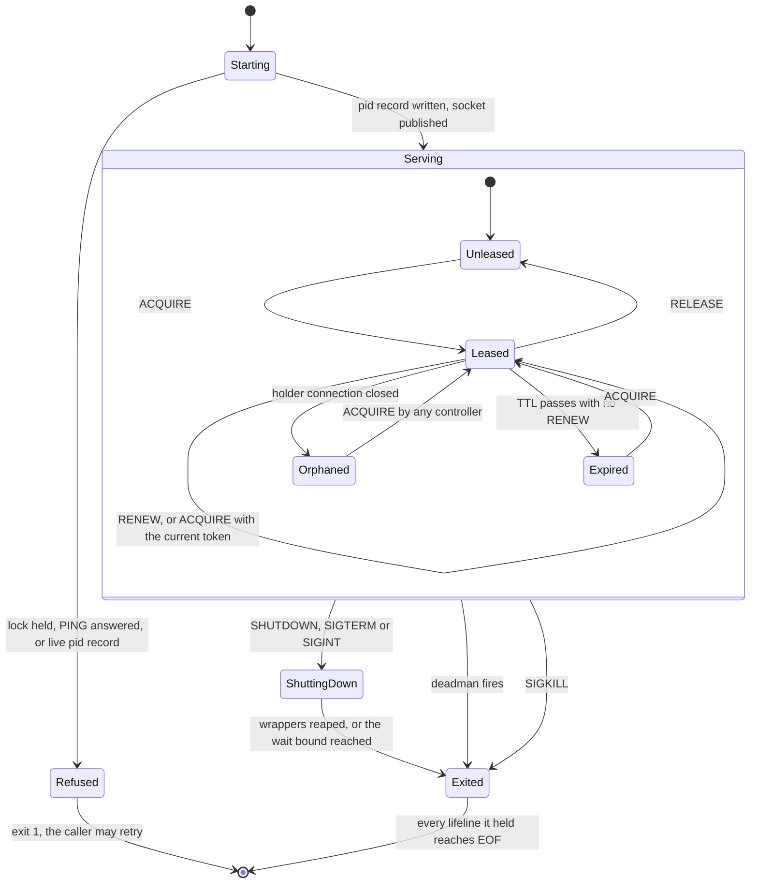

# Supervisor

## Purpose

The [supervisor](../glossary.md#supervisor) keeps the parent of each [detached](../glossary.md#detached) run alive across engine restarts.
It forks one [wrapper](../glossary.md#wrapper) per SPAWN, holds each wrapper's lifeline, reaps the wrapper and pushes its exit to the controller.
It decides nothing about what runs; the engine's oracle does.

## Fate

The code and the contract carry over unchanged. It needs none of the storage capabilities.
Reason: `src/dsl41/runner_supervisor.py` imports nothing from dsl41 and never reads the WAL or the ledger; its [lease](../glossary.md#lease) and run table are in memory, and its records are files in the [run root](../glossary.md#run-root).
One limit is about transport, not storage: a lease freed on EOF needs a local socket ([supervisor-protocol §5](../supervisor-protocol.md#5-supervisor-socket-protocol-frozen--phase-11f-dl-48), "Constraint on any future non-local transport").

## Interface

- Started by file path, never with `-m`, by `dsl41 supervise start` or by `SupervisorClient.ensure_running`, with `--run-root` and an optional `--deadman-seconds`.
- Run-root files: `supervisor.sock` (mode 0600), `supervisor.pid` and `supervisor.lock`. The spawner points stderr at `supervisor.log`.
- Verbs, as JSON lines: `PING` and `LIST` (read-only); `ACQUIRE`, `RENEW` and `RELEASE` (lease); `SPAWN`, `SIGNAL` and `SHUTDOWN` (mutating). Async `exit` pushes go to the lease holder.
- Engine side: `SupervisorClient` holds and renews the lease, demuxes pushes and runs the shared LIST check. `SupervisedCommandAdapter` spawns, awaits and kills.
- SPAWN's replay rules have their own card: [SPAWN idempotency](spawn-idempotency.md).

## States

## Invariants

- One supervisor per run root. Startup takes `supervisor.lock` and proves the old owner absent before it reclaims the socket ([supervisor-protocol §5](../supervisor-protocol.md#5-supervisor-socket-protocol-frozen--phase-11f-dl-48); DL-210).
- The write end of each wrapper's lifeline lives in the supervisor only, which detaches job lifetime from the engine ([runner-design §6a](../runner-design.md#6a-process-lifecycle-tiers-dl-41a); DL-48).
- The tier holds no policy. Its lifecycle time bounds are the lease TTL, the SHUTDOWN waits and the optional deadman ([supervisor-protocol preamble](../supervisor-protocol.md#supervisor-protocol--the-lifecycle-tiers-public-contract)); §5 also bounds the startup PING probe and the teardown flush. `SIGNAL` sends one signal and never escalates; only `SHUTDOWN` escalates TERM to KILL (§5).
- One controller at a time. A live lease yields only to a claimant with the current token and this [incarnation](../glossary.md#incarnation); a lease whose holder's connection is gone is free (§5 lease verbs; DL-79).
- Every mutating verb carries `incarnation` and `token`. `wrong_incarnation` is checked first and is a different answer from `stale_token` (§5; DL-80).
- Signals go to the recorded command group, never to the wrapper, and only after the (pid, start-time) guard ([supervisor-protocol §3, spawn.json](../supervisor-protocol.md#spawnjson--written-by-the-wrapper-immediately-after-spawning)).
- Pushes are notifications. The spool is the truth across a restart, and `LIST` shows this incarnation's memory only (§5; DL-205).
- A handler that raises is answered `internal:` and never ends the process, and a client that stops reading never blocks the loop (§5; DL-210).
- The deadman is opt-in. With it, no live leaseholder for N seconds ends the process (§5 "The deadman"; DL-95).
- The module is stdlib-only and runs by file path ([supervisor-protocol §1](../supervisor-protocol.md#1-roles); DL-42).

## Failure and recovery

- Engine crash: the wrappers keep running. Resume re-acquires at once, because the dead holder's connection is gone, then reattaches live runs and sends the rest to the spool ladder (DL-48 item 6; DL-79).
- Supervisor killed with -9: each wrapper takes lifeline EOF, kills its group and records in its own time. The engine tries one reconnect, then reads the spool ([runner-design §7](../runner-design.md#7-journal-and-recovery-e1-prod-grade); DL-205). A restarted supervisor has a new incarnation and an empty `LIST`.
- A request cancelled mid-flight: the client closes that connection and reconnects, and the fresh token fences the old one (DL-48 item 9).
- Five failed renewals in a row: the client gives up and the leader marks the host unreachable ([concurrency-model §8](../concurrency-model.md#8-host-lifecycle-active-passive-quarantined-evicted); DL-210). Outcomes still resolve from the spool.
- A dropped push: the next reply to the holder carries `pushes_dropped`, and the client re-asks `LIST` (§5 "Pushes"; DL-210).
- A start that loses the lock exits 1. The client respawns up to three times inside its connect window (DL-210).

## Owning modules

- `src/dsl41/runner_supervisor.py`: the process, the protocol, the lease, reaping, `SHUTDOWN` and the deadman.
- `src/dsl41/runner_procid.py`: the lock, the durable writes, the boot id, the PID-reuse guard and the group kill.
- `src/dsl41/runner_adapters.py`: `SupervisorClient` and `SupervisedCommandAdapter`, the engine side.

## Tests

- Boundary: `test_supervisor_imports_are_stdlib_only`, `test_supervisor_serves_under_pythonsafepath`.
- Lease and fencing: `test_live_lease_yields_only_to_the_token_holder`, `test_dead_holder_frees_the_lease_without_waiting_out_the_ttl`, `test_fencing_survives_a_supervisor_restart_token_reuse`, `test_mutating_verbs_require_a_token`, `test_renew_loop_reacquires_after_lease_lapse`, `test_cancelled_request_poisons_and_reconnects`.
- Signals and shutdown: `test_signal_pid_reuse_guard_refuses_spoofed_spawn`, `test_signal_in_the_spawn_window_is_not_ready_not_a_noop`, `test_shutdown_orderly_records_signaled_never_parent_lost`, `test_shutdown_waits_for_late_spawn_record`.
- Deadman: `test_cm10_the_deadman_fires_and_takes_its_wrappers_with_it`, `test_a_live_leaseholder_reprieves_the_deadman`, `test_a_supervisor_with_no_deadman_outlives_its_controller`.
- Engine and supervisor deaths: `test_sigkill_engine_detached_survives_and_reattaches`, `test_kill_supervisor_midrun_engine_resolves_via_spool`, `test_detach_stop_sigint_then_resume_reattaches`, `test_oracle_kill_detached_terminates`.
- Ownership and transport: `test_dl210_lock_loser_exits_one_and_can_retry`, `test_dl210_pid_guard_requires_proven_absence`, `test_dl210_nonreader_cannot_block_reaping_ping_or_shutdown`, `test_full_listen_backlog_does_not_let_client_unlink_live_socket`.

## Open findings

See the row "Supervisor ownership, transport, lease" in [the risk map](../risk-map.md).
The map ranks it third among the [least-tested machines](../risk-map.md#least-tested-machines).
All three owning modules are [outside the 100% gate](../risk-map.md#owning-modules-outside-the-100-gate).
The supervisor runs as a subprocess, so its measured numbers are floors.
The common finding, [no transition inventory](../risk-map.md#no-transition-inventory), applies too.

## Gaps found

- [runner-design §6a](../runner-design.md#6a-process-lifecycle-tiers-dl-41a) says the supervisor has "no timers", and so does the module docstring of `runner_supervisor.py`, which later calls the deadman "not purely reactive". The [supervisor-protocol preamble](../supervisor-protocol.md#supervisor-protocol--the-lifecycle-tiers-public-contract), amended by DL-150, names three lifecycle bounds: the lease TTL, the SHUTDOWN waits and the optional deadman. DL-150 has ruled; runner-design §6a and the docstring are stale. The preamble's list is itself incomplete: §5 also bounds the startup PING probe and the teardown flush, and the loop reaps on a one-second tick.
