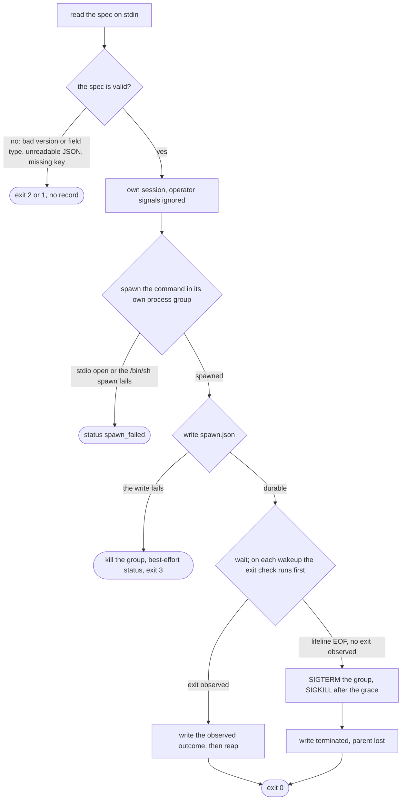

# Wrapper

## Purpose

The [wrapper](../glossary.md#wrapper) is the direct parent of one run's command.
Unix gives one `wait()` observation of an exit, so the direct parent is the one process that cannot miss it.
The wrapper writes that status durably, and it kills the command's group when its own parent dies.

## Fate

The code and the contract carry over unchanged. It needs none of the storage capabilities.
Reason: `runner_wrapper.py` imports only the standard library and `runner_procid.py`, and it writes two files in the run directory; it never touches the WAL or the ledger.
It does need the run directory on a local filesystem ([supervisor-protocol §3](../supervisor-protocol.md#3-spool-format-frozen)), which is a filesystem property, not a row of the storage table.

## Interface

- Run as `sys.executable <path>/runner_wrapper.py`, never with `-m`.
- Input: one JSON object on stdin, the frozen spec of [supervisor-protocol §2](../supervisor-protocol.md#2-wrapper-input-spec-frozen). `lifeline_fd` is the read end of a pipe whose write end the spawner holds.
- Output: `spawn.json`, then `status.json`, in `run_dir` ([§3](../supervisor-protocol.md#3-spool-format-frozen)). The outcome vocabulary is `WrapperOutcome`.
- Exit code: a notification only, never the outcome ([§4](../supervisor-protocol.md#4-wrapper-behavior-frozen-semantics) step 6).
- Spawners: `LocalCommandAdapter` in [tethered](../glossary.md#tethered) mode, where the engine holds the write end, and `Supervisor._spawn_wrapper` in [detached](../glossary.md#detached) mode. Both engine-side spec builders, in `LocalCommandAdapter` and `SupervisedCommandAdapter`, use `_build_run_spec`; the supervisor takes the spec off the wire and fills only `lifeline_fd`.
- Readers: `load_json`, `outcome_from_status` and `resolve_spool` in `src/dsl41/runner_adapters.py`.
- `DSL41_WRAPPER_TEST_PAUSE` names pause points for the kill-matrix tests. It is inert when unset.

## States

The wrapper is a straight-line procedure, not a declared machine; [the policies](policies.md#wrapper-outcome) say why.
The flowchart shows its steps:

## Invariants

- Stdlib-only, run by file path and parent-agnostic ([supervisor-protocol §1](../supervisor-protocol.md#1-roles); [runner-design §6a](../runner-design.md#6a-process-lifecycle-tiers-dl-41a); DL-42).
- The command has its own process group, apart from the wrapper's, so a group kill never kills the recorder (DL-41a item 2; [§3, spawn.json](../supervisor-protocol.md#spawnjson--written-by-the-wrapper-immediately-after-spawning)).
- The lifeline's write end lives in exactly one process, the spawner. EOF means the parent died, `kill -9` included (DL-41a item 3; runner-design §6a, "Lifeline fd hygiene").
- On every wakeup the exit check runs before the lifeline-EOF check ([§4](../supervisor-protocol.md#4-wrapper-behavior-frozen-semantics) step 3).
- Record before reap, with one stated exception: the path where the `spawn.json` write failed ([§3, status.json](../supervisor-protocol.md#statusjson--written-by-the-wrapper-before-reaping); DL-229 item 1).
- Every record uses the durability liturgy on a local filesystem ([§3](../supervisor-protocol.md#3-spool-format-frozen); DL-41a item 4).
- `status.json` is the sole data channel and appears at most once. Its absence is the E7 case (§3, status.json).
- A pid whose start-time token does not match the record is never signalled (§3, spawn.json; DL-41a item 5).
- The `DSL41_RUN` tag is forensics only, never identity ([§3](../supervisor-protocol.md#dsl41_run-env-tag--forensics-only)).
- The wrapper ignores a fixed set of signals, and the command restores their defaults before exec (§4 steps 1 and 2; DL-229 item 6).

## Failure and recovery

- The parent dies, engine or supervisor: the wrapper kills the group and records `terminated` with cause `parent lost` (§4 step 5). In tethered mode, engine death therefore ends and records every job ([runner-design §6a](../runner-design.md#6a-process-lifecycle-tiers-dl-41a)).
- The wrapper alone, or the whole tree, is killed with -9, and no `status.json` lands. Resume's spool ladder kills a verified survivor and records TERMINATED, or else reports FAILURE `exit_status_unobservable` ([runner-design §7](../runner-design.md#7-journal-and-recovery-e1-prod-grade); §3, status.json; DL-41a item 6).
- A reboot: a `boot_id` mismatch voids liveness checks and proves nothing survived (§3, spawn.json; DL-42 item 5).
- A full disk: the record write fails and the wrapper exits 3. The missing record reads as E7 (§4 step 6).
- An oracle kill in tethered mode: the engine sends TERM to the group, waits the grace, then sends KILL, and the wrapper records the death ([runner-design §6](../runner-design.md#6-adapters)).
- A command that escapes its group with `setsid` or a double fork is not contained. That is a stated limit (runner-design §6a, "Containment honesty").

## Owning modules

- `src/dsl41/runner_wrapper.py`: the shim.
- `src/dsl41/runner_procid.py`: the liturgy, the boot id, start-time tokens and the quiet group kill.
- `src/dsl41/runner_adapters.py`: the tethered spawner, the spec builder, the outcome mapping and the spool ladder.

## Tests

- Boundary: `test_wrapper_imports_are_stdlib_only`, `test_wrapper_records_under_pythonsafepath`.
- Recording: `test_wrapper_records_natural_exit_and_appends_stdout`, `test_wrapper_survives_external_group_kill_and_records_signal`, `test_wrapper_survives_sigusr1_and_sigusr2_and_still_records`, `test_wrapper_refuses_mistyped_spec_field_before_spawning`, `test_dl151_the_wrapper_records_a_spawn_it_could_not_open`.
- Parent loss: `test_wrapper_graceful_sigterm_reaches_command_on_parent_loss`, `test_lifeline_write_end_leaks_nowhere`, `test_sigkill_engine_midrun_then_resume`.
- Kill matrix: `test_kill_before_spawn_record_is_unobservable_and_never_signals`, `test_kill_after_spawn_record_survivor_killed_at_resume`, `test_kill_between_wait_and_status_write_is_unobservable`, `test_kill_between_status_write_and_reap_preserves_outcome`, `test_resume_kill_reaches_a_member_that_ignores_sigterm`.
- Identity: `test_spoofed_spawn_json_never_signals_innocents`, `test_boot_id_flip_voids_liveness_and_resolves_from_records`.
- Write failures: `test_rc3_a_spawn_that_cannot_be_recorded_kills_what_it_started`, `test_rc3_a_status_that_cannot_be_written_never_reports_an_outcome`, `test_rc3_a_full_disk_at_spawn_leaves_no_record_and_exits_three`.
- Outcome mapping: `test_m3_malformed_status_records_map_truthfully`.

## Open findings

See the row "Wrapper and command" in [the risk map](../risk-map.md).
All three owning modules are in the 100% gate ([DL-294, DL-299](../risk-map.md#closed-by-dl-289dl-306)), and the row lists no open finding.
The wrapper runs as a subprocess, and a process a test ends with SIGKILL loses its coverage data, so its numbers are floors.

## Gaps found

None.
