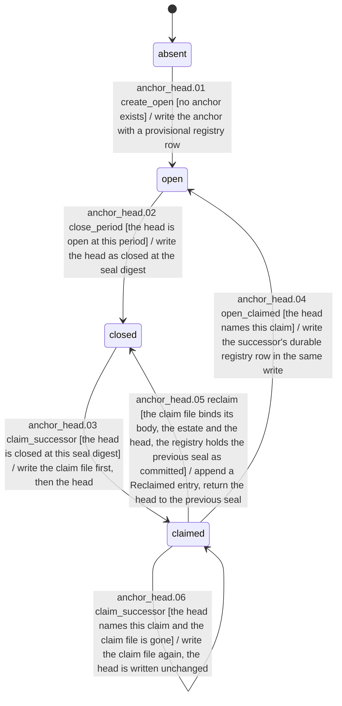
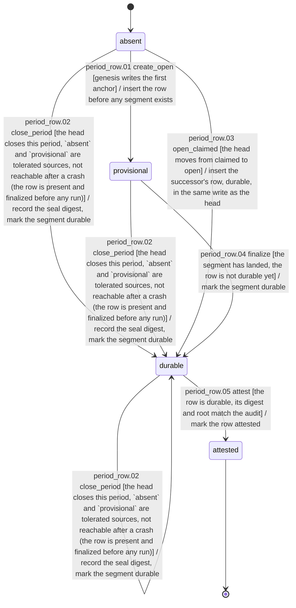
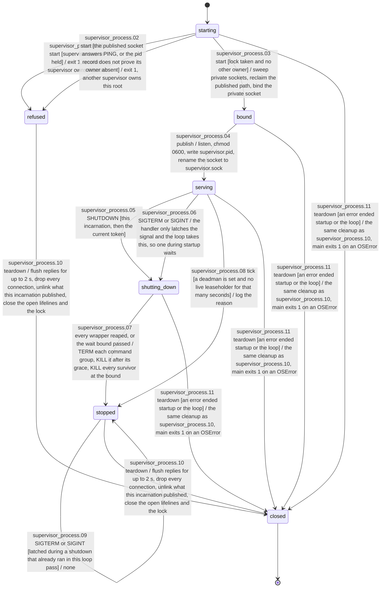
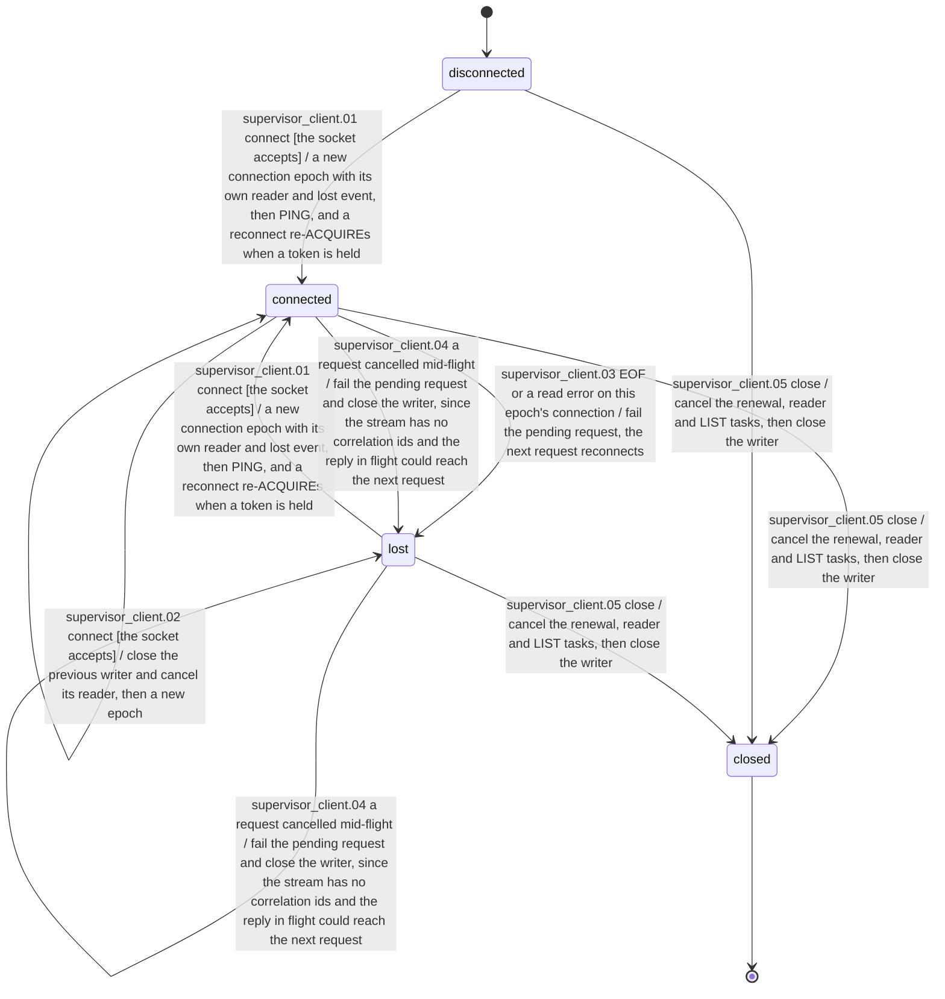

# State machines

This file is generated from `dsl41.machines`; regenerate it with `uv run python scripts/render_state_machines.py`.

## anchor_head

| Id | Source | Trigger | Guard | Effect | Target | Cite | Mark |
| --- | --- | --- | --- | --- | --- | --- | --- |
| anchor_head.01 | absent | create_open | no anchor exists | write the anchor with a provisional registry row | open | period-model ss1.1, ss1.3 |  |
| anchor_head.02 | open | close_period | the head is open at this period | write the head as closed at the seal digest | closed | period-model ss1.3, ss3 |  |
| anchor_head.03 | closed | claim_successor | the head is closed at this seal digest | write the claim file first, then the head | claimed | period-model ss1.3 |  |
| anchor_head.04 | claimed | open_claimed | the head names this claim | write the successor's durable registry row in the same write | open | period-model ss1.3, PR-02c |  |
| anchor_head.05 | claimed | reclaim | the claim file binds its body, the estate and the head, the registry holds the previous seal as committed | append a Reclaimed entry, return the head to the previous seal | closed | period-model ss1.3 |  |
| anchor_head.06 | claimed | claim_successor | the head names this claim and the claim file is gone | write the claim file again, the head is written unchanged | claimed | period-model ss1.3 |  |

## period_row

| Id | Source | Trigger | Guard | Effect | Target | Cite | Mark |
| --- | --- | --- | --- | --- | --- | --- | --- |
| period_row.01 | absent | create_open | genesis writes the first anchor | insert the row before any segment exists | provisional | period-model ss1.3, PR-02c |  |
| period_row.02 | absent, durable, provisional | close_period | the head closes this period, `absent` and `provisional` are tolerated sources, not reachable after a crash (the row is present and finalized before any run) | record the seal digest, mark the segment durable | durable | period-model ss1.3, ss3 |  |
| period_row.03 | absent | open_claimed | the head moves from claimed to open | insert the successor's row, durable, in the same write as the head | durable | period-model ss1.3, PR-02c |  |
| period_row.04 | provisional | finalize | the segment has landed, the row is not durable yet | mark the segment durable | durable | period-model ss1.3 |  |
| period_row.05 | durable | attest | the row is durable, its digest and root match the audit | mark the row attested | attested | period-model ss1.3, ss11 |  |

## supervisor_process

| Id | Source | Trigger | Guard | Effect | Target | Cite | Mark |
| --- | --- | --- | --- | --- | --- | --- | --- |
| supervisor_process.01 | starting | start | supervisor.lock is held | exit 1, another supervisor owns this root | refused | supervisor-protocol ss5, DL-210 |  |
| supervisor_process.02 | starting | start | the published socket answers PING, or the pid record does not prove its owner absent | exit 1, another supervisor owns this root | refused | supervisor-protocol ss5, DL-210 |  |
| supervisor_process.03 | starting | start | lock taken and no other owner | sweep private sockets, reclaim the published path, bind the private socket | bound | supervisor-protocol ss5, DL-210 |  |
| supervisor_process.04 | bound | publish |  | listen, chmod 0600, write supervisor.pid, rename the socket to supervisor.sock | serving | supervisor-protocol ss5, DL-210, DL-275 |  |
| supervisor_process.05 | serving | SHUTDOWN | this incarnation, then the current token |  | shutting_down | supervisor-protocol ss5 SHUTDOWN, DL-80 |  |
| supervisor_process.06 | serving | SIGTERM or SIGINT |  | the handler only latches the signal and the loop takes this, so one during startup waits | shutting_down | supervisor-protocol ss5 SHUTDOWN, DL-275 |  |
| supervisor_process.07 | shutting_down | every wrapper reaped, or the wait bound passed |  | TERM each command group, KILL it after its grace, KILL every survivor at the bound | stopped | supervisor-protocol ss5 SHUTDOWN, DL-48, DL-150 |  |
| supervisor_process.08 | serving | tick | a deadman is set and no live leaseholder for that many seconds | log the reason | stopped | supervisor-protocol ss5 The deadman, DL-95 |  |
| supervisor_process.09 | stopped | SIGTERM or SIGINT | latched during a shutdown that already ran in this loop pass | none | stopped | supervisor-protocol ss5 SHUTDOWN |  |
| supervisor_process.10 | refused, stopped | teardown |  | flush replies for up to 2 s, drop every connection, unlink what this incarnation published, close the open lifelines and the lock | closed | supervisor-protocol ss5, DL-210 |  |
| supervisor_process.11 | bound, serving, shutting_down, starting | teardown | an error ended startup or the loop | the same cleanup as supervisor_process.10, main exits 1 on an OSError | closed | supervisor-protocol ss5, DL-210 |  |

## supervisor_lease

| Id | Source | Trigger | Guard | Effect | Target | Cite | Mark |
| --- | --- | --- | --- | --- | --- | --- | --- |
| supervisor_lease.01 | expired, free, orphaned | ACQUIRE | controller_id is a non-empty string | mint a token, keep the dropped-push notice for the same controller_id, a ttl_s that is not positive grants a lease that is already expired | expired, live | supervisor-protocol ss5 lease verbs, DL-79, DL-150 |  |
| supervisor_lease.02 | live | ACQUIRE | the incumbent, with this incarnation and the current token | re-key with a fresh token, and the old one dies | expired, live | supervisor-protocol ss5 lease verbs, DL-79, DL-80 |  |
| supervisor_lease.03 | live | RENEW | this incarnation, then the current token | move the deadline to now + ttl_s | expired, live | supervisor-protocol ss5 lease verbs, DL-150 |  |
| supervisor_lease.04 | orphaned | RENEW | this incarnation, then the current token | move the deadline to now + ttl_s, pushes still drop until an ACQUIRE | expired, orphaned | supervisor-protocol ss5 lease verbs, DL-150 |  |
| supervisor_lease.05 | live, orphaned | RELEASE | this incarnation, then the current token | drop the record | free | supervisor-protocol ss5 lease verbs, DL-150 |  |
| supervisor_lease.06 | live | the holder's connection closes |  | forget the connection, so pushes drop and any controller may ACQUIRE | orphaned | supervisor-protocol ss5 lease verbs, DL-150 |  |
| supervisor_lease.07 | expired | the holder's connection closes |  | forget the connection | expired | supervisor-protocol ss5 lease verbs |  |

## supervisor_client

| Id | Source | Trigger | Guard | Effect | Target | Cite | Mark |
| --- | --- | --- | --- | --- | --- | --- | --- |
| supervisor_client.01 | disconnected, lost | connect | the socket accepts | a new connection epoch with its own reader and lost event, then PING, and a reconnect re-ACQUIREs when a token is held | connected | supervisor-protocol ss5, DL-48, DL-79 |  |
| supervisor_client.02 | connected | connect | the socket accepts | close the previous writer and cancel its reader, then a new epoch | connected | DL-48 |  |
| supervisor_client.03 | connected | EOF or a read error on this epoch's connection |  | fail the pending request, the next request reconnects | lost | supervisor-protocol ss5, runner-design ss7, DL-48 |  |
| supervisor_client.04 | connected, lost | a request cancelled mid-flight |  | fail the pending request and close the writer, since the stream has no correlation ids and the reply in flight could reach the next request | lost | DL-48 |  |
| supervisor_client.05 | connected, disconnected, lost | close |  | cancel the renewal, reader and LIST tasks, then close the writer | closed | DL-48 |  |
