# State machines

This file is generated from `dsl41.machines`; regenerate it with `uv run python scripts/render_state_machines.py`.

## job_status

```mermaid
stateDiagram-v2
    state "FAILURE" as s0
    state "INACTIVE" as s1
    state "QUE_WAIT" as s2
    state "RUNNING" as s3
    state "STARTING" as s4
    state "SUCCESS" as s5
    state "TERMINATED" as s6
    state c18 <<choice>>
    [*] --> s1
    s0 --> s5 : job_status.01 start [not a box, the job, or a box above it, is ON_NOEXEC] / start_run, no capacity is taken
    s1 --> s5 : job_status.01 start [not a box, the job, or a box above it, is ON_NOEXEC] / start_run, no capacity is taken
    s5 --> s5 : job_status.01 start [not a box, the job, or a box above it, is ON_NOEXEC] / start_run, no capacity is taken
    s6 --> s5 : job_status.01 start [not a box, the job, or a box above it, is ON_NOEXEC] / start_run, no capacity is taken
    s0 --> s4 : job_status.02 start [not a box, the gates hold, inside the run window, admissible] / arm term_run_time, start_run, reserve, or take over held units
    s1 --> s4 : job_status.02 start [not a box, the gates hold, inside the run window, admissible] / arm term_run_time, start_run, reserve, or take over held units
    s5 --> s4 : job_status.02 start [not a box, the gates hold, inside the run window, admissible] / arm term_run_time, start_run, reserve, or take over held units
    s6 --> s4 : job_status.02 start [not a box, the gates hold, inside the run window, admissible] / arm term_run_time, start_run, reserve, or take over held units
    s0 --> s2 : job_status.03 start [the gates hold, inside the run window, not admissible] / enqueue_waiter allocates the rank
    s1 --> s2 : job_status.03 start [the gates hold, inside the run window, not admissible] / enqueue_waiter allocates the rank
    s5 --> s2 : job_status.03 start [the gates hold, inside the run window, not admissible] / enqueue_waiter allocates the rank
    s6 --> s2 : job_status.03 start [the gates hold, inside the run window, not admissible] / enqueue_waiter allocates the rank
    s0 --> s4 : job_status.04 FORCE_STARTJOB [the job holds units from an earlier run] / start on the held units and the machine load, no admission test
    s6 --> s4 : job_status.04 FORCE_STARTJOB [the job holds units from an earlier run] / start on the held units and the machine load, no admission test
    s4 --> s3 : job_status.05 started [not a box, still STARTING at this run]
    s0 --> s1 : job_status.06 start [standalone, outside run_window, closer to the previous close]
    s5 --> s1 : job_status.06 start [standalone, outside run_window, closer to the previous close]
    s6 --> s1 : job_status.06 start [standalone, outside run_window, closer to the previous close]
    s0 --> s1 : job_status.07 start [its box is RUNNING and it has not run there, outside run_window, closer to the previous close] / record_resolution, the box's completion door runs
    s5 --> s1 : job_status.07 start [its box is RUNNING and it has not run there, outside run_window, closer to the previous close] / record_resolution, the box's completion door runs
    s6 --> s1 : job_status.07 start [its box is RUNNING and it has not run there, outside run_window, closer to the previous close] / record_resolution, the box's completion door runs
    s2 --> s4 : job_status.08 readmit [its box is RUNNING, not held, admissible, queued-recheck passes] / dequeue_waiter, reserve, start_run
    s2 --> s1 : job_status.09 readmit [its box is not RUNNING, a full scan] / dequeue_waiter
    s2 --> s1 : job_status.10 readmit [queued-recheck fails] / disarm, dequeue_waiter, void_resolution, then defer or skip
    s2 --> s6 : job_status.11 KILLJOB / dequeue_waiter, disarm
    s2 --> s1 : job_status.12 ON_ICE / set ON_ICE, dequeue_waiter
    s2 --> s1 : job_status.13 ON_NOEXEC [not a box, not ignored] / set ON_NOEXEC, dequeue_waiter, clear the exit code, retry the start
    s3 --> s6 : job_status.14 KILLJOB / a box kills its job_terminator members
    s4 --> s6 : job_status.14 KILLJOB / a box kills its job_terminator members
    s3 --> s6 : job_status.15 TIMER term_run_time [the timer's run is the row's run] / a box kills its job_terminator members
    s3 --> s6 : job_status.16 box ends FAILURE or TERMINATED [a member with job_terminator] / a box kills its own job_terminator members
    s4 --> s6 : job_status.16 box ends FAILURE or TERMINATED [a member with job_terminator] / a box kills its own job_terminator members
    s0 --> s5 : job_status.17 STATUS exit_code [exit_is_success] / release the run's units on leaving STARTING or RUNNING
    s1 --> s5 : job_status.17 STATUS exit_code [exit_is_success] / release the run's units on leaving STARTING or RUNNING
    s2 --> s5 : job_status.17 STATUS exit_code [exit_is_success] / release the run's units on leaving STARTING or RUNNING
    s3 --> s5 : job_status.17 STATUS exit_code [exit_is_success] / release the run's units on leaving STARTING or RUNNING
    s4 --> s5 : job_status.17 STATUS exit_code [exit_is_success] / release the run's units on leaving STARTING or RUNNING
    s5 --> s5 : job_status.17 STATUS exit_code [exit_is_success] / release the run's units on leaving STARTING or RUNNING
    s6 --> s5 : job_status.17 STATUS exit_code [exit_is_success] / release the run's units on leaving STARTING or RUNNING
    s0 --> s0 : job_status.18 STATUS exit_code [not exit_is_success] / release the run's units on leaving STARTING or RUNNING
    s1 --> s0 : job_status.18 STATUS exit_code [not exit_is_success] / release the run's units on leaving STARTING or RUNNING
    s2 --> s0 : job_status.18 STATUS exit_code [not exit_is_success] / release the run's units on leaving STARTING or RUNNING
    s3 --> s0 : job_status.18 STATUS exit_code [not exit_is_success] / release the run's units on leaving STARTING or RUNNING
    s4 --> s0 : job_status.18 STATUS exit_code [not exit_is_success] / release the run's units on leaving STARTING or RUNNING
    s5 --> s0 : job_status.18 STATUS exit_code [not exit_is_success] / release the run's units on leaving STARTING or RUNNING
    s6 --> s0 : job_status.18 STATUS exit_code [not exit_is_success] / release the run's units on leaving STARTING or RUNNING
    s0 --> c18 : job_status.19 STATUS status [the status is not INACTIVE, or the job has no catalog entry] / release the run's units on leaving STARTING or RUNNING
    s1 --> c18 : job_status.19 STATUS status [the status is not INACTIVE, or the job has no catalog entry] / release the run's units on leaving STARTING or RUNNING
    s2 --> c18 : job_status.19 STATUS status [the status is not INACTIVE, or the job has no catalog entry] / release the run's units on leaving STARTING or RUNNING
    s3 --> c18 : job_status.19 STATUS status [the status is not INACTIVE, or the job has no catalog entry] / release the run's units on leaving STARTING or RUNNING
    s4 --> c18 : job_status.19 STATUS status [the status is not INACTIVE, or the job has no catalog entry] / release the run's units on leaving STARTING or RUNNING
    s5 --> c18 : job_status.19 STATUS status [the status is not INACTIVE, or the job has no catalog entry] / release the run's units on leaving STARTING or RUNNING
    s6 --> c18 : job_status.19 STATUS status [the status is not INACTIVE, or the job has no catalog entry] / release the run's units on leaving STARTING or RUNNING
    c18 --> s0
    c18 --> s1
    c18 --> s3
    c18 --> s4
    c18 --> s5
    c18 --> s6
    s0 --> s1 : job_status.20 STATUS INACTIVE [a catalog job, not a box] / record_resolution when its box is RUNNING, SEM-15 on an idle box
    s1 --> s1 : job_status.20 STATUS INACTIVE [a catalog job, not a box] / record_resolution when its box is RUNNING, SEM-15 on an idle box
    s2 --> s1 : job_status.20 STATUS INACTIVE [a catalog job, not a box] / record_resolution when its box is RUNNING, SEM-15 on an idle box
    s3 --> s1 : job_status.20 STATUS INACTIVE [a catalog job, not a box] / record_resolution when its box is RUNNING, SEM-15 on an idle box
    s4 --> s1 : job_status.20 STATUS INACTIVE [a catalog job, not a box] / record_resolution when its box is RUNNING, SEM-15 on an idle box
    s5 --> s1 : job_status.20 STATUS INACTIVE [a catalog job, not a box] / record_resolution when its box is RUNNING, SEM-15 on an idle box
    s6 --> s1 : job_status.20 STATUS INACTIVE [a catalog job, not a box] / record_resolution when its box is RUNNING, SEM-15 on an idle box
    s0 --> s1 : job_status.21 ON_NOEXEC [not a box, not ignored] / set ON_NOEXEC, clear the exit code
    s6 --> s1 : job_status.21 ON_NOEXEC [not a box, not ignored] / set ON_NOEXEC, clear the exit code
    s0 --> s1 : job_status.22 box start [contained, not live or queued] / one batch around the box's STARTING, clear the exit code
    s5 --> s1 : job_status.22 box start [contained, not live or queued] / one batch around the box's STARTING, clear the exit code
    s6 --> s1 : job_status.22 box start [contained, not live or queued] / one batch around the box's STARTING, clear the exit code
    s0 --> s1 : job_status.23 box set INACTIVE [contained] / one batch with the box's own row, the box runs inside lose their arms
    s2 --> s1 : job_status.23 box set INACTIVE [contained] / one batch with the box's own row, the box runs inside lose their arms
    s3 --> s1 : job_status.23 box set INACTIVE [contained] / one batch with the box's own row, the box runs inside lose their arms
    s4 --> s1 : job_status.23 box set INACTIVE [contained] / one batch with the box's own row, the box runs inside lose their arms
    s5 --> s1 : job_status.23 box set INACTIVE [contained] / one batch with the box's own row, the box runs inside lose their arms
    s6 --> s1 : job_status.23 box set INACTIVE [contained] / one batch with the box's own row, the box runs inside lose their arms
    s0 --> s4 : job_status.24 start [a box, the gates hold, inside the run window, admissible] / start_run, reset the contained jobs around this write
    s1 --> s4 : job_status.24 start [a box, the gates hold, inside the run window, admissible] / start_run, reset the contained jobs around this write
    s5 --> s4 : job_status.24 start [a box, the gates hold, inside the run window, admissible] / start_run, reset the contained jobs around this write
    s6 --> s4 : job_status.24 start [a box, the gates hold, inside the run window, admissible] / start_run, reset the contained jobs around this write
    s4 --> s3 : job_status.25 started [a box, still STARTING at this run] / auto_hold members, attempt every member, decide the run windows
    s3 --> s5 : job_status.26 member moves [box_success holds]
    s3 --> s0 : job_status.27 member moves [box_failure holds] / kill the job_terminator members
    s3 --> s5 : job_status.28 completion moment [every member done, no failed vote, no box_success]
    s3 --> s0 : job_status.29 completion moment [every member done, a failed vote, no box_failure] / kill the job_terminator members
    s3 --> s6 : job_status.30 member ends FAILURE or TERMINATED [the member has box_terminator, a TERMINATED end only under box-terminator-on-terminated=true] / kill the job_terminator members
    s0 --> s5 : job_status.31 member ends, or a member set INACTIVE [under idle-box-iced-member=ignore, every member that is neither INACTIVE nor out on ice is terminal, and one votes or the changed member is not out on ice, under vote, every member not INACTIVE is terminal, box_success holds]
    s1 --> s5 : job_status.31 member ends, or a member set INACTIVE [under idle-box-iced-member=ignore, every member that is neither INACTIVE nor out on ice is terminal, and one votes or the changed member is not out on ice, under vote, every member not INACTIVE is terminal, box_success holds]
    s2 --> s5 : job_status.31 member ends, or a member set INACTIVE [under idle-box-iced-member=ignore, every member that is neither INACTIVE nor out on ice is terminal, and one votes or the changed member is not out on ice, under vote, every member not INACTIVE is terminal, box_success holds]
    s1 --> s0 : job_status.32 member ends, or a member set INACTIVE [under idle-box-iced-member=ignore, every member that is neither INACTIVE nor out on ice is terminal, and one votes or the changed member is not out on ice, under vote, every member not INACTIVE is terminal, box_failure holds]
    s2 --> s0 : job_status.32 member ends, or a member set INACTIVE [under idle-box-iced-member=ignore, every member that is neither INACTIVE nor out on ice is terminal, and one votes or the changed member is not out on ice, under vote, every member not INACTIVE is terminal, box_failure holds]
    s5 --> s0 : job_status.32 member ends, or a member set INACTIVE [under idle-box-iced-member=ignore, every member that is neither INACTIVE nor out on ice is terminal, and one votes or the changed member is not out on ice, under vote, every member not INACTIVE is terminal, box_failure holds]
    s0 --> s5 : job_status.33 member ends, or a member set INACTIVE [under idle-box-iced-member=ignore, every member that is neither INACTIVE nor out on ice is terminal, and one votes or the changed member is not out on ice, under vote, every member not INACTIVE is terminal, no override holds, no member failed, no box_success]
    s1 --> s5 : job_status.33 member ends, or a member set INACTIVE [under idle-box-iced-member=ignore, every member that is neither INACTIVE nor out on ice is terminal, and one votes or the changed member is not out on ice, under vote, every member not INACTIVE is terminal, no override holds, no member failed, no box_success]
    s2 --> s5 : job_status.33 member ends, or a member set INACTIVE [under idle-box-iced-member=ignore, every member that is neither INACTIVE nor out on ice is terminal, and one votes or the changed member is not out on ice, under vote, every member not INACTIVE is terminal, no override holds, no member failed, no box_success]
    s1 --> s0 : job_status.34 member ends, or a member set INACTIVE [under idle-box-iced-member=ignore, every member that is neither INACTIVE nor out on ice is terminal, and one votes or the changed member is not out on ice, under vote, every member not INACTIVE is terminal, no override holds, a member failed, no box_failure]
    s2 --> s0 : job_status.34 member ends, or a member set INACTIVE [under idle-box-iced-member=ignore, every member that is neither INACTIVE nor out on ice is terminal, and one votes or the changed member is not out on ice, under vote, every member not INACTIVE is terminal, no override holds, a member failed, no box_failure]
    s5 --> s0 : job_status.34 member ends, or a member set INACTIVE [under idle-box-iced-member=ignore, every member that is neither INACTIVE nor out on ice is terminal, and one votes or the changed member is not out on ice, under vote, every member not INACTIVE is terminal, no override holds, a member failed, no box_failure]
    s0 --> s1 : job_status.35 STATUS INACTIVE [a box] / the SEM-18 cascade, one batch
    s1 --> s1 : job_status.35 STATUS INACTIVE [a box] / the SEM-18 cascade, one batch
    s2 --> s1 : job_status.35 STATUS INACTIVE [a box] / the SEM-18 cascade, one batch
    s3 --> s1 : job_status.35 STATUS INACTIVE [a box] / the SEM-18 cascade, one batch
    s4 --> s1 : job_status.35 STATUS INACTIVE [a box] / the SEM-18 cascade, one batch
    s5 --> s1 : job_status.35 STATUS INACTIVE [a box] / the SEM-18 cascade, one batch
    s6 --> s1 : job_status.35 STATUS INACTIVE [a box] / the SEM-18 cascade, one batch
    s0 --> s1 : job_status.36 ON_NOEXEC [a box, not ignored, a job in its tree is not INACTIVE, or its parent is RUNNING] / flag the tree, the SEM-18 cascade, one batch
    s1 --> s1 : job_status.36 ON_NOEXEC [a box, not ignored, a job in its tree is not INACTIVE, or its parent is RUNNING] / flag the tree, the SEM-18 cascade, one batch
    s2 --> s1 : job_status.36 ON_NOEXEC [a box, not ignored, a job in its tree is not INACTIVE, or its parent is RUNNING] / flag the tree, the SEM-18 cascade, one batch
    s4 --> s1 : job_status.36 ON_NOEXEC [a box, not ignored, a job in its tree is not INACTIVE, or its parent is RUNNING] / flag the tree, the SEM-18 cascade, one batch
    s5 --> s1 : job_status.36 ON_NOEXEC [a box, not ignored, a job in its tree is not INACTIVE, or its parent is RUNNING] / flag the tree, the SEM-18 cascade, one batch
    s6 --> s1 : job_status.36 ON_NOEXEC [a box, not ignored, a job in its tree is not INACTIVE, or its parent is RUNNING] / flag the tree, the SEM-18 cascade, one batch
    s1 --> s1 : job_status.37 KILLJOB [not running or queued] / an EVENT_IGNORED trace line
    s5 --> s5 : job_status.38 KILLJOB [not running or queued] / an EVENT_IGNORED trace line
    s0 --> s0 : job_status.39 KILLJOB [not running or queued] / an EVENT_IGNORED trace line
    s6 --> s6 : job_status.40 KILLJOB [not running or queued] / an EVENT_IGNORED trace line
    s1 --> s1 : job_status.41 start refused [already live or queued, a member whose box is not RUNNING, or that ran in this box execution, or was taken off ice in it, a stale deferred start or scan, a start nested inside two starts of the same job (a re-trigger loop)] / a START_REFUSED trace line
    s2 --> s2 : job_status.42 start refused [already live or queued, a member whose box is not RUNNING, or that ran in this box execution, or was taken off ice in it, a stale deferred start or scan, a start nested inside two starts of the same job (a re-trigger loop)] / a START_REFUSED trace line
    s4 --> s4 : job_status.43 start refused [already live or queued, a member whose box is not RUNNING, or that ran in this box execution, or was taken off ice in it, a stale deferred start or scan, a start nested inside two starts of the same job (a re-trigger loop)] / a START_REFUSED trace line
    s3 --> s3 : job_status.44 start refused [already live or queued, a member whose box is not RUNNING, or that ran in this box execution, or was taken off ice in it, a stale deferred start or scan, a start nested inside two starts of the same job (a re-trigger loop)] / a START_REFUSED trace line
    s5 --> s5 : job_status.45 start refused [already live or queued, a member whose box is not RUNNING, or that ran in this box execution, or was taken off ice in it, a stale deferred start or scan, a start nested inside two starts of the same job (a re-trigger loop)] / a START_REFUSED trace line
    s0 --> s0 : job_status.46 start refused [already live or queued, a member whose box is not RUNNING, or that ran in this box execution, or was taken off ice in it, a stale deferred start or scan, a start nested inside two starts of the same job (a re-trigger loop)] / a START_REFUSED trace line
    s6 --> s6 : job_status.47 start refused [already live or queued, a member whose box is not RUNNING, or that ran in this box execution, or was taken off ice in it, a stale deferred start or scan, a start nested inside two starts of the same job (a re-trigger loop)] / a START_REFUSED trace line
    s4 --> s4 : job_status.48 ON_ICE [the vendor ignores it for a live job] / an EVENT_IGNORED trace line
    s3 --> s3 : job_status.49 ON_ICE [the vendor ignores it for a live job] / an EVENT_IGNORED trace line
    s4 --> s4 : job_status.50 ON_HOLD [the vendor ignores it for a live job] / an EVENT_IGNORED trace line
    s3 --> s3 : job_status.51 ON_HOLD [the vendor ignores it for a live job] / an EVENT_IGNORED trace line
    s1 --> s1 : job_status.52 ON_NOEXEC [the job is ON_ICE, a job STARTING or RUNNING, a box RUNNING, or with a job inside that is ON_ICE, live or queued (a queued box only so)] / an EVENT_IGNORED trace line
    s4 --> s4 : job_status.53 ON_NOEXEC [the job is ON_ICE, a job STARTING or RUNNING, a box RUNNING, or with a job inside that is ON_ICE, live or queued (a queued box only so)] / an EVENT_IGNORED trace line
    s3 --> s3 : job_status.54 ON_NOEXEC [the job is ON_ICE, a job STARTING or RUNNING, a box RUNNING, or with a job inside that is ON_ICE, live or queued (a queued box only so)] / an EVENT_IGNORED trace line
    s5 --> s5 : job_status.55 ON_NOEXEC [the job is ON_ICE, a job STARTING or RUNNING, a box RUNNING, or with a job inside that is ON_ICE, live or queued (a queued box only so)] / an EVENT_IGNORED trace line
    s0 --> s0 : job_status.56 ON_NOEXEC [the job is ON_ICE, a job STARTING or RUNNING, a box RUNNING, or with a job inside that is ON_ICE, live or queued (a queued box only so)] / an EVENT_IGNORED trace line
    s6 --> s6 : job_status.57 ON_NOEXEC [the job is ON_ICE, a job STARTING or RUNNING, a box RUNNING, or with a job inside that is ON_ICE, live or queued (a queued box only so)] / an EVENT_IGNORED trace line
    s2 --> s2 : job_status.58 ON_NOEXEC [the job is ON_ICE, a job STARTING or RUNNING, a box RUNNING, or with a job inside that is ON_ICE, live or queued (a queued box only so)] / an EVENT_IGNORED trace line
```

| Id | Source | Trigger | Guard | Effect | Target | Cite | Mark |
| --- | --- | --- | --- | --- | --- | --- | --- |
| job_status.01 | FAILURE, INACTIVE, SUCCESS, TERMINATED | start | not a box, the job, or a box above it, is ON_NOEXEC | start_run, no capacity is taken | SUCCESS | SEM-22, DL-54 |  |
| job_status.02 | FAILURE, INACTIVE, SUCCESS, TERMINATED | start | not a box, the gates hold, inside the run window, admissible | arm term_run_time, start_run, reserve, or take over held units | STARTING | SEM-10, DL-50, DL-120 |  |
| job_status.03 | FAILURE, INACTIVE, SUCCESS, TERMINATED | start | the gates hold, inside the run window, not admissible | enqueue_waiter allocates the rank | QUE_WAIT | DL-50, DL-247, DL-255 |  |
| job_status.04 | FAILURE, TERMINATED | FORCE_STARTJOB | the job holds units from an earlier run | start on the held units and the machine load, no admission test | STARTING | DL-256 |  |
| job_status.05 | STARTING | started | not a box, still STARTING at this run |  | RUNNING | SEM-10 |  |
| job_status.06 | FAILURE, SUCCESS, TERMINATED | start | standalone, outside run_window, closer to the previous close |  | INACTIVE | SEM-33, DL-246 |  |
| job_status.07 | FAILURE, SUCCESS, TERMINATED | start | its box is RUNNING and it has not run there, outside run_window, closer to the previous close | record_resolution, the box's completion door runs | INACTIVE | SEM-33, DL-154 |  |
| job_status.08 | QUE_WAIT | readmit | its box is RUNNING, not held, admissible, queued-recheck passes | dequeue_waiter, reserve, start_run | STARTING | DL-50, DL-257 |  |
| job_status.09 | QUE_WAIT | readmit | its box is not RUNNING, a full scan | dequeue_waiter | INACTIVE | DL-50, DL-247 |  |
| job_status.10 | QUE_WAIT | readmit | queued-recheck fails | disarm, dequeue_waiter, void_resolution, then defer or skip | INACTIVE | DL-257 |  |
| job_status.11 | QUE_WAIT | KILLJOB |  | dequeue_waiter, disarm | TERMINATED | DL-50, DL-54 |  |
| job_status.12 | QUE_WAIT | ON_ICE |  | set ON_ICE, dequeue_waiter | INACTIVE | DL-50, DL-285 |  |
| job_status.13 | QUE_WAIT | ON_NOEXEC | not a box, not ignored | set ON_NOEXEC, dequeue_waiter, clear the exit code, retry the start | INACTIVE | DL-254 |  |
| job_status.14 | RUNNING, STARTING | KILLJOB |  | a box kills its job_terminator members | TERMINATED | SEM-14 |  |
| job_status.15 | RUNNING | TIMER term_run_time | the timer's run is the row's run | a box kills its job_terminator members | TERMINATED | autosys-semantics ss5 |  |
| job_status.16 | RUNNING, STARTING | box ends FAILURE or TERMINATED | a member with job_terminator | a box kills its own job_terminator members | TERMINATED | SEM-14 |  |
| job_status.17 | FAILURE, INACTIVE, QUE_WAIT, RUNNING, STARTING, SUCCESS, TERMINATED | STATUS exit_code | exit_is_success | release the run's units on leaving STARTING or RUNNING | SUCCESS | SEM-09 |  |
| job_status.18 | FAILURE, INACTIVE, QUE_WAIT, RUNNING, STARTING, SUCCESS, TERMINATED | STATUS exit_code | not exit_is_success | release the run's units on leaving STARTING or RUNNING | FAILURE | SEM-09 |  |
| job_status.19 | FAILURE, INACTIVE, QUE_WAIT, RUNNING, STARTING, SUCCESS, TERMINATED | STATUS status | the status is not INACTIVE, or the job has no catalog entry | release the run's units on leaving STARTING or RUNNING | FAILURE, INACTIVE, RUNNING, STARTING, SUCCESS, TERMINATED | DL-13, DL-264 |  |
| job_status.20 | FAILURE, INACTIVE, QUE_WAIT, RUNNING, STARTING, SUCCESS, TERMINATED | STATUS INACTIVE | a catalog job, not a box | record_resolution when its box is RUNNING, SEM-15 on an idle box | INACTIVE | DL-242, DL-235 |  |
| job_status.21 | FAILURE, TERMINATED | ON_NOEXEC | not a box, not ignored | set ON_NOEXEC, clear the exit code | INACTIVE | SEM-22, DL-243 |  |
| job_status.22 | FAILURE, SUCCESS, TERMINATED | box start | contained, not live or queued | one batch around the box's STARTING, clear the exit code | INACTIVE | SEM-10, DL-242 |  |
| job_status.23 | FAILURE, QUE_WAIT, RUNNING, STARTING, SUCCESS, TERMINATED | box set INACTIVE | contained | one batch with the box's own row, the box runs inside lose their arms | INACTIVE | SEM-18, DL-242 |  |
| job_status.24 | FAILURE, INACTIVE, SUCCESS, TERMINATED | start | a box, the gates hold, inside the run window, admissible | start_run, reset the contained jobs around this write | STARTING | SEM-10, DL-242 |  |
| job_status.25 | STARTING | started | a box, still STARTING at this run | auto_hold members, attempt every member, decide the run windows | RUNNING | SEM-10, SEM-33, DL-246 |  |
| job_status.26 | RUNNING | member moves | box_success holds |  | SUCCESS | SEM-12 |  |
| job_status.27 | RUNNING | member moves | box_failure holds | kill the job_terminator members | FAILURE | SEM-12, SEM-14 |  |
| job_status.28 | RUNNING | completion moment | every member done, no failed vote, no box_success |  | SUCCESS | SEM-11 |  |
| job_status.29 | RUNNING | completion moment | every member done, a failed vote, no box_failure | kill the job_terminator members | FAILURE | SEM-11, SEM-14 |  |
| job_status.30 | RUNNING | member ends FAILURE or TERMINATED | the member has box_terminator, a TERMINATED end only under box-terminator-on-terminated=true | kill the job_terminator members | TERMINATED | SEM-14 |  |
| job_status.31 | FAILURE, INACTIVE, QUE_WAIT | member ends, or a member set INACTIVE | under idle-box-iced-member=ignore, every member that is neither INACTIVE nor out on ice is terminal, and one votes or the changed member is not out on ice, under vote, every member not INACTIVE is terminal, box_success holds |  | SUCCESS | SEM-15 |  |
| job_status.32 | INACTIVE, QUE_WAIT, SUCCESS | member ends, or a member set INACTIVE | under idle-box-iced-member=ignore, every member that is neither INACTIVE nor out on ice is terminal, and one votes or the changed member is not out on ice, under vote, every member not INACTIVE is terminal, box_failure holds |  | FAILURE | SEM-15 |  |
| job_status.33 | FAILURE, INACTIVE, QUE_WAIT | member ends, or a member set INACTIVE | under idle-box-iced-member=ignore, every member that is neither INACTIVE nor out on ice is terminal, and one votes or the changed member is not out on ice, under vote, every member not INACTIVE is terminal, no override holds, no member failed, no box_success |  | SUCCESS | SEM-15, DL-242 |  |
| job_status.34 | INACTIVE, QUE_WAIT, SUCCESS | member ends, or a member set INACTIVE | under idle-box-iced-member=ignore, every member that is neither INACTIVE nor out on ice is terminal, and one votes or the changed member is not out on ice, under vote, every member not INACTIVE is terminal, no override holds, a member failed, no box_failure |  | FAILURE | SEM-15, DL-242 |  |
| job_status.35 | FAILURE, INACTIVE, QUE_WAIT, RUNNING, STARTING, SUCCESS, TERMINATED | STATUS INACTIVE | a box | the SEM-18 cascade, one batch | INACTIVE | SEM-18, DL-242 |  |
| job_status.36 | FAILURE, INACTIVE, QUE_WAIT, STARTING, SUCCESS, TERMINATED | ON_NOEXEC | a box, not ignored, a job in its tree is not INACTIVE, or its parent is RUNNING | flag the tree, the SEM-18 cascade, one batch | INACTIVE | DL-254 |  |
| job_status.37 | INACTIVE | KILLJOB | not running or queued | an EVENT_IGNORED trace line | INACTIVE | DL-64, DL-81 |  |
| job_status.38 | SUCCESS | KILLJOB | not running or queued | an EVENT_IGNORED trace line | SUCCESS | DL-64, DL-81 |  |
| job_status.39 | FAILURE | KILLJOB | not running or queued | an EVENT_IGNORED trace line | FAILURE | DL-64, DL-81 |  |
| job_status.40 | TERMINATED | KILLJOB | not running or queued | an EVENT_IGNORED trace line | TERMINATED | DL-64, DL-81 |  |
| job_status.41 | INACTIVE | start refused | already live or queued, a member whose box is not RUNNING, or that ran in this box execution, or was taken off ice in it, a stale deferred start or scan, a start nested inside two starts of the same job (a re-trigger loop) | a START_REFUSED trace line | INACTIVE | DL-64, DL-81, DL-246, DL-257, SEM-20, DL-304 |  |
| job_status.42 | QUE_WAIT | start refused | already live or queued, a member whose box is not RUNNING, or that ran in this box execution, or was taken off ice in it, a stale deferred start or scan, a start nested inside two starts of the same job (a re-trigger loop) | a START_REFUSED trace line | QUE_WAIT | DL-64, DL-81, DL-246, DL-257, SEM-20, DL-304 |  |
| job_status.43 | STARTING | start refused | already live or queued, a member whose box is not RUNNING, or that ran in this box execution, or was taken off ice in it, a stale deferred start or scan, a start nested inside two starts of the same job (a re-trigger loop) | a START_REFUSED trace line | STARTING | DL-64, DL-81, DL-246, DL-257, SEM-20, DL-304 |  |
| job_status.44 | RUNNING | start refused | already live or queued, a member whose box is not RUNNING, or that ran in this box execution, or was taken off ice in it, a stale deferred start or scan, a start nested inside two starts of the same job (a re-trigger loop) | a START_REFUSED trace line | RUNNING | DL-64, DL-81, DL-246, DL-257, SEM-20, DL-304 |  |
| job_status.45 | SUCCESS | start refused | already live or queued, a member whose box is not RUNNING, or that ran in this box execution, or was taken off ice in it, a stale deferred start or scan, a start nested inside two starts of the same job (a re-trigger loop) | a START_REFUSED trace line | SUCCESS | DL-64, DL-81, DL-246, DL-257, SEM-20, DL-304 |  |
| job_status.46 | FAILURE | start refused | already live or queued, a member whose box is not RUNNING, or that ran in this box execution, or was taken off ice in it, a stale deferred start or scan, a start nested inside two starts of the same job (a re-trigger loop) | a START_REFUSED trace line | FAILURE | DL-64, DL-81, DL-246, DL-257, SEM-20, DL-304 |  |
| job_status.47 | TERMINATED | start refused | already live or queued, a member whose box is not RUNNING, or that ran in this box execution, or was taken off ice in it, a stale deferred start or scan, a start nested inside two starts of the same job (a re-trigger loop) | a START_REFUSED trace line | TERMINATED | DL-64, DL-81, DL-246, DL-257, SEM-20, DL-304 |  |
| job_status.48 | STARTING | ON_ICE | the vendor ignores it for a live job | an EVENT_IGNORED trace line | STARTING | DL-254 |  |
| job_status.49 | RUNNING | ON_ICE | the vendor ignores it for a live job | an EVENT_IGNORED trace line | RUNNING | DL-254 |  |
| job_status.50 | STARTING | ON_HOLD | the vendor ignores it for a live job | an EVENT_IGNORED trace line | STARTING | DL-254 |  |
| job_status.51 | RUNNING | ON_HOLD | the vendor ignores it for a live job | an EVENT_IGNORED trace line | RUNNING | DL-254 |  |
| job_status.52 | INACTIVE | ON_NOEXEC | the job is ON_ICE, a job STARTING or RUNNING, a box RUNNING, or with a job inside that is ON_ICE, live or queued (a queued box only so) | an EVENT_IGNORED trace line | INACTIVE | DL-254 |  |
| job_status.53 | STARTING | ON_NOEXEC | the job is ON_ICE, a job STARTING or RUNNING, a box RUNNING, or with a job inside that is ON_ICE, live or queued (a queued box only so) | an EVENT_IGNORED trace line | STARTING | DL-254 |  |
| job_status.54 | RUNNING | ON_NOEXEC | the job is ON_ICE, a job STARTING or RUNNING, a box RUNNING, or with a job inside that is ON_ICE, live or queued (a queued box only so) | an EVENT_IGNORED trace line | RUNNING | DL-254 |  |
| job_status.55 | SUCCESS | ON_NOEXEC | the job is ON_ICE, a job STARTING or RUNNING, a box RUNNING, or with a job inside that is ON_ICE, live or queued (a queued box only so) | an EVENT_IGNORED trace line | SUCCESS | DL-254 |  |
| job_status.56 | FAILURE | ON_NOEXEC | the job is ON_ICE, a job STARTING or RUNNING, a box RUNNING, or with a job inside that is ON_ICE, live or queued (a queued box only so) | an EVENT_IGNORED trace line | FAILURE | DL-254 |  |
| job_status.57 | TERMINATED | ON_NOEXEC | the job is ON_ICE, a job STARTING or RUNNING, a box RUNNING, or with a job inside that is ON_ICE, live or queued (a queued box only so) | an EVENT_IGNORED trace line | TERMINATED | DL-254 |  |
| job_status.58 | QUE_WAIT | ON_NOEXEC | the job is ON_ICE, a job STARTING or RUNNING, a box RUNNING, or with a job inside that is ON_ICE, live or queued (a queued box only so) | an EVENT_IGNORED trace line | QUE_WAIT | DL-254 |  |

## job_flags

```mermaid
stateDiagram-v2
    state "arm_off" as s0
    state "arm_on" as s1
    state "hold_off" as s2
    state "hold_on" as s3
    state "ice_off" as s4
    state "ice_on" as s5
    state "noexec_off" as s6
    state "noexec_on" as s7
    s4 --> s5 : job_flags.01 ON_ICE [not STARTING or RUNNING (else ignored), a second ice changes nothing] / a queued job leaves the queue, a first ice on a member is a completion moment
    s5 --> s5 : job_flags.01 ON_ICE [not STARTING or RUNNING (else ignored), a second ice changes nothing] / a queued job leaves the queue, a first ice on a member is a completion moment
    s4 --> s4 : job_flags.02 OFF_ICE / no re-evaluation: conditions must reoccur. From ice_on only, under off-ice-in-running-box=next-run: a member of a RUNNING box that has not run there sits that run out
    s5 --> s4 : job_flags.02 OFF_ICE / no re-evaluation: conditions must reoccur. From ice_on only, under off-ice-in-running-box=next-run: a member of a RUNNING box that has not run there sits that run out
    s5 --> s4 : job_flags.03 FORCE_STARTJOB [not live] / the start goes on
    s2 --> s3 : job_flags.04 ON_HOLD [not STARTING or RUNNING (else ignored)] / a held waiter blocks no one
    s3 --> s3 : job_flags.04 ON_HOLD [not STARTING or RUNNING (else ignored)] / a held waiter blocks no one
    s2 --> s2 : job_flags.05 OFF_HOLD / attempt the start, or wake the queue for a queued job
    s3 --> s2 : job_flags.05 OFF_HOLD / attempt the start, or wake the queue for a queued job
    s3 --> s2 : job_flags.06 FORCE_STARTJOB [not live] / the start goes on
    s3 --> s2 : job_flags.07 ON_NOEXEC [not ignored] / ON_NOEXEC supersedes ON_HOLD, the start is retried
    s2 --> s3 : job_flags.08 box start [a member with auto_hold]
    s6 --> s7 : job_flags.09 ON_NOEXEC [not ignored, the job, or every job in a box's tree]
    s7 --> s7 : job_flags.09 ON_NOEXEC [not ignored, the job, or every job in a box's tree]
    s6 --> s6 : job_flags.10 OFF_NOEXEC
    s7 --> s6 : job_flags.10 OFF_NOEXEC
    s7 --> s6 : job_flags.11 OFF_NOEXEC on its box [contained in the box]
    s0 --> s1 : job_flags.12 scheduled tick blocked [held or its condition false, a schedule, a member's box is RUNNING] / a SCHED_ARM trace line
    s0 --> s0 : job_flags.13 actual start / start_run
    s1 --> s0 : job_flags.13 actual start / start_run
    s0 --> s0 : job_flags.14 DISARM / a DISARM trace line
    s1 --> s0 : job_flags.14 DISARM / a DISARM trace line
    s1 --> s0 : job_flags.15 box run ends [a member, its box reaches a terminal status or is set INACTIVE] / a SCHED_DISARM trace line
    s1 --> s0 : job_flags.16 leave QUE_WAIT unstarted / a SCHED_DISARM trace line
    s0 --> s0 : job_flags.17 KILLJOB on QUE_WAIT
    s1 --> s0 : job_flags.17 KILLJOB on QUE_WAIT
```

| Id | Source | Trigger | Guard | Effect | Target | Cite | Mark |
| --- | --- | --- | --- | --- | --- | --- | --- |
| job_flags.01 | ice_off, ice_on | ON_ICE | not STARTING or RUNNING (else ignored), a second ice changes nothing | a queued job leaves the queue, a first ice on a member is a completion moment | ice_on | SEM-20, DL-254, DL-285 |  |
| job_flags.02 | ice_off, ice_on | OFF_ICE |  | no re-evaluation: conditions must reoccur. From ice_on only, under off-ice-in-running-box=next-run: a member of a RUNNING box that has not run there sits that run out | ice_off | SEM-20 |  |
| job_flags.03 | ice_on | FORCE_STARTJOB | not live | the start goes on | ice_off | SEM-23, DL-243 |  |
| job_flags.04 | hold_off, hold_on | ON_HOLD | not STARTING or RUNNING (else ignored) | a held waiter blocks no one | hold_on | SEM-21, DL-254, DL-247 |  |
| job_flags.05 | hold_off, hold_on | OFF_HOLD |  | attempt the start, or wake the queue for a queued job | hold_off | SEM-21, DL-50 |  |
| job_flags.06 | hold_on | FORCE_STARTJOB | not live | the start goes on | hold_off | SEM-23, DL-243 |  |
| job_flags.07 | hold_on | ON_NOEXEC | not ignored | ON_NOEXEC supersedes ON_HOLD, the start is retried | hold_off | DL-254 |  |
| job_flags.08 | hold_off | box start | a member with auto_hold |  | hold_on | autosys-semantics ss5 |  |
| job_flags.09 | noexec_off, noexec_on | ON_NOEXEC | not ignored, the job, or every job in a box's tree |  | noexec_on | SEM-22, DL-254 |  |
| job_flags.10 | noexec_off, noexec_on | OFF_NOEXEC |  |  | noexec_off | DL-243 |  |
| job_flags.11 | noexec_on | OFF_NOEXEC on its box | contained in the box |  | noexec_off | DL-254 |  |
| job_flags.12 | arm_off | scheduled tick blocked | held or its condition false, a schedule, a member's box is RUNNING | a SCHED_ARM trace line | arm_on | SEM-32, DL-54 |  |
| job_flags.13 | arm_off, arm_on | actual start |  | start_run | arm_off | DL-54 |  |
| job_flags.14 | arm_off, arm_on | DISARM |  | a DISARM trace line | arm_off | DL-158 |  |
| job_flags.15 | arm_on | box run ends | a member, its box reaches a terminal status or is set INACTIVE | a SCHED_DISARM trace line | arm_off | DL-54 |  |
| job_flags.16 | arm_on | leave QUE_WAIT unstarted |  | a SCHED_DISARM trace line | arm_off | DL-257 |  |
| job_flags.17 | arm_off, arm_on | KILLJOB on QUE_WAIT |  |  | arm_off | DL-54 |  |

## job_holding

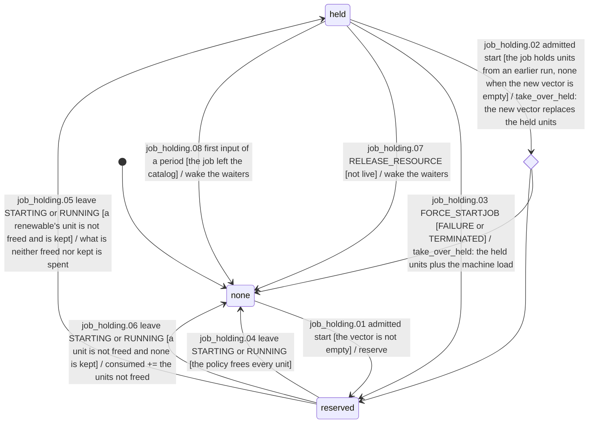

| Id | Source | Trigger | Guard | Effect | Target | Cite | Mark |
| --- | --- | --- | --- | --- | --- | --- | --- |
| job_holding.01 | none | admitted start | the vector is not empty | reserve | reserved | DL-120 |  |
| job_holding.02 | held | admitted start | the job holds units from an earlier run, none when the new vector is empty | take_over_held: the new vector replaces the held units | none, reserved | DL-256 |  |
| job_holding.03 | held | FORCE_STARTJOB | FAILURE or TERMINATED | take_over_held: the held units plus the machine load | reserved | DL-256 |  |
| job_holding.04 | reserved | leave STARTING or RUNNING | the policy frees every unit |  | none | DL-50, DL-120 |  |
| job_holding.05 | reserved | leave STARTING or RUNNING | a renewable's unit is not freed and is kept | what is neither freed nor kept is spent | held | DL-256 |  |
| job_holding.06 | reserved | leave STARTING or RUNNING | a unit is not freed and none is kept | consumed += the units not freed | none | SEM-16, DL-120 |  |
| job_holding.07 | held | RELEASE_RESOURCE | not live | wake the waiters | none | DL-256 |  |
| job_holding.08 | held | first input of a period | the job left the catalog | wake the waiters | none | DL-256 |  |

## runtime_assembly

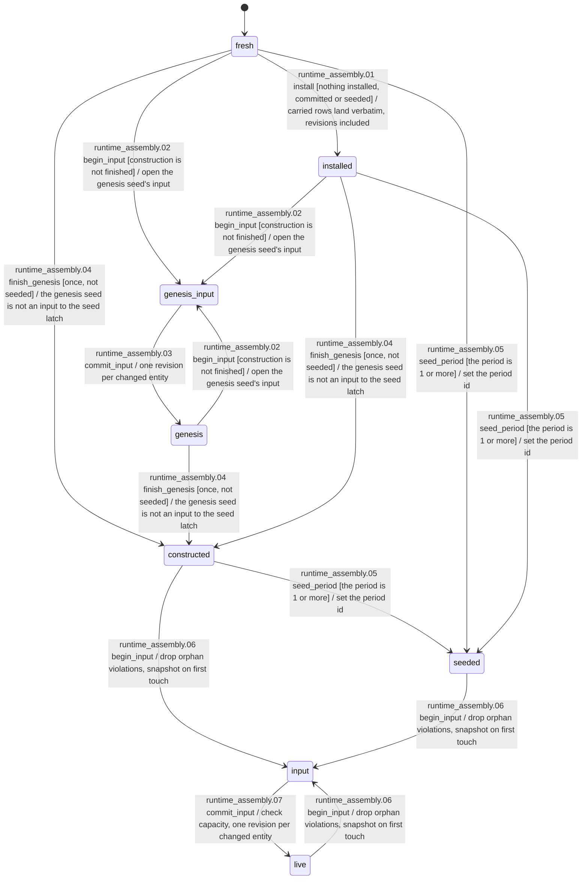

| Id | Source | Trigger | Guard | Effect | Target | Cite | Mark |
| --- | --- | --- | --- | --- | --- | --- | --- |
| runtime_assembly.01 | fresh | install | nothing installed, committed or seeded | carried rows land verbatim, revisions included | installed | period-model ss7 |  |
| runtime_assembly.02 | fresh, genesis, installed | begin_input | construction is not finished | open the genesis seed's input | genesis_input | DL-87 |  |
| runtime_assembly.03 | genesis_input | commit_input |  | one revision per changed entity | genesis | DL-87 |  |
| runtime_assembly.04 | fresh, genesis, installed | finish_genesis | once, not seeded | the genesis seed is not an input to the seed latch | constructed | DL-132 |  |
| runtime_assembly.05 | constructed, fresh, installed | seed_period | the period is 1 or more | set the period id | seeded | period-model ss3.5, DL-132 |  |
| runtime_assembly.06 | constructed, live, seeded | begin_input |  | drop orphan violations, snapshot on first touch | input | DL-87, concurrency-model ss3 |  |
| runtime_assembly.07 | input | commit_input |  | check capacity, one revision per changed entity | live | DL-87, DL-120 |  |

## anchor_head

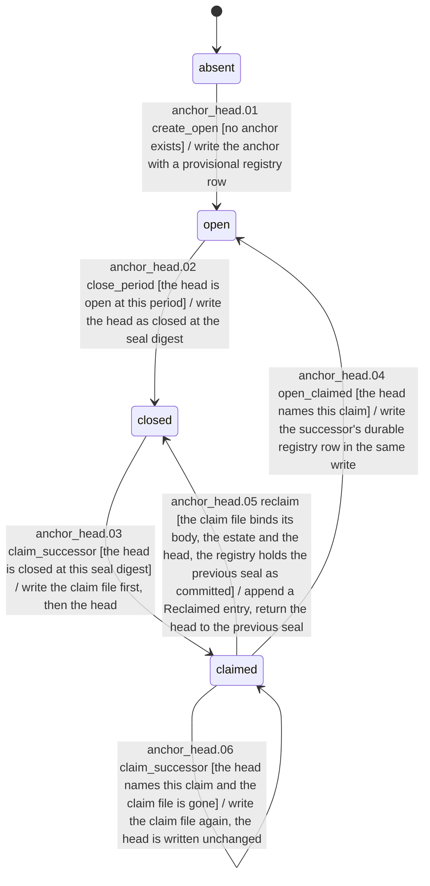

| Id | Source | Trigger | Guard | Effect | Target | Cite | Mark |
| --- | --- | --- | --- | --- | --- | --- | --- |
| anchor_head.01 | absent | create_open | no anchor exists | write the anchor with a provisional registry row | open | period-model ss1.1, ss1.3 |  |
| anchor_head.02 | open | close_period | the head is open at this period | write the head as closed at the seal digest | closed | period-model ss1.3, ss3 |  |
| anchor_head.03 | closed | claim_successor | the head is closed at this seal digest | write the claim file first, then the head | claimed | period-model ss1.3 |  |
| anchor_head.04 | claimed | open_claimed | the head names this claim | write the successor's durable registry row in the same write | open | period-model ss1.3, PR-02c |  |
| anchor_head.05 | claimed | reclaim | the claim file binds its body, the estate and the head, the registry holds the previous seal as committed | append a Reclaimed entry, return the head to the previous seal | closed | period-model ss1.3 |  |
| anchor_head.06 | claimed | claim_successor | the head names this claim and the claim file is gone | write the claim file again, the head is written unchanged | claimed | period-model ss1.3 |  |

## period_row

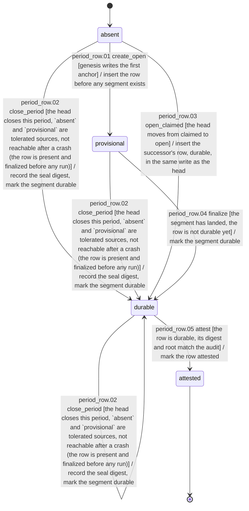

| Id | Source | Trigger | Guard | Effect | Target | Cite | Mark |
| --- | --- | --- | --- | --- | --- | --- | --- |
| period_row.01 | absent | create_open | genesis writes the first anchor | insert the row before any segment exists | provisional | period-model ss1.3, PR-02c |  |
| period_row.02 | absent, durable, provisional | close_period | the head closes this period, `absent` and `provisional` are tolerated sources, not reachable after a crash (the row is present and finalized before any run) | record the seal digest, mark the segment durable | durable | period-model ss1.3, ss3 |  |
| period_row.03 | absent | open_claimed | the head moves from claimed to open | insert the successor's row, durable, in the same write as the head | durable | period-model ss1.3, PR-02c |  |
| period_row.04 | provisional | finalize | the segment has landed, the row is not durable yet | mark the segment durable | durable | period-model ss1.3 |  |
| period_row.05 | durable | attest | the row is durable, its digest and root match the audit | mark the row attested | attested | period-model ss1.3, ss11 |  |

## supervisor_process

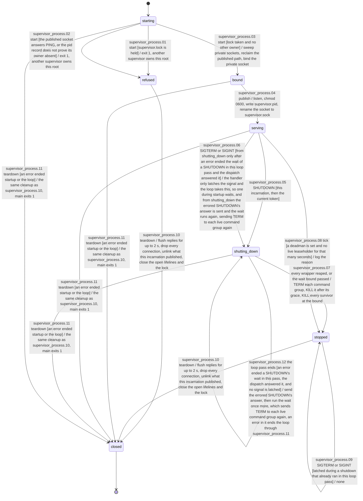

| Id | Source | Trigger | Guard | Effect | Target | Cite | Mark |
| --- | --- | --- | --- | --- | --- | --- | --- |
| supervisor_process.01 | starting | start | supervisor.lock is held | exit 1, another supervisor owns this root | refused | supervisor-protocol ss5, DL-210 |  |
| supervisor_process.02 | starting | start | the published socket answers PING, or the pid record does not prove its owner absent | exit 1, another supervisor owns this root | refused | supervisor-protocol ss5, DL-210 |  |
| supervisor_process.03 | starting | start | lock taken and no other owner | sweep private sockets, reclaim the published path, bind the private socket | bound | supervisor-protocol ss5, DL-210 |  |
| supervisor_process.04 | bound | publish |  | listen, chmod 0600, write supervisor.pid, rename the socket to supervisor.sock | serving | supervisor-protocol ss5, DL-210, DL-275 |  |
| supervisor_process.05 | serving | SHUTDOWN | this incarnation, then the current token |  | shutting_down | supervisor-protocol ss5 SHUTDOWN, DL-80 |  |
| supervisor_process.06 | serving, shutting_down | SIGTERM or SIGINT | from shutting_down only after an error ended the wait of a SHUTDOWN in this loop pass and the dispatch answered it | the handler only latches the signal and the loop takes this, so one during startup waits, and from shutting_down the errored SHUTDOWN's answer is sent and the wait runs again, sending TERM to each live command group again | shutting_down | supervisor-protocol ss5 SHUTDOWN, DL-275 |  |
| supervisor_process.07 | shutting_down | every wrapper reaped, or the wait bound passed |  | TERM each command group, KILL it after its grace, KILL every survivor at the bound | stopped | supervisor-protocol ss5 SHUTDOWN, DL-48, DL-150 |  |
| supervisor_process.08 | serving | tick | a deadman is set and no live leaseholder for that many seconds | log the reason | stopped | supervisor-protocol ss5 The deadman, DL-95 |  |
| supervisor_process.09 | stopped | SIGTERM or SIGINT | latched during a shutdown that already ran in this loop pass | none | stopped | supervisor-protocol ss5 SHUTDOWN |  |
| supervisor_process.10 | refused, stopped | teardown |  | flush replies for up to 2 s, drop every connection, unlink what this incarnation published, close the open lifelines and the lock | closed | supervisor-protocol ss5, DL-210 |  |
| supervisor_process.11 | bound, serving, shutting_down, starting | teardown | an error ended startup or the loop | the same cleanup as supervisor_process.10, main exits 1 | closed | supervisor-protocol ss5, DL-210 |  |
| supervisor_process.12 | shutting_down | the loop pass ends | an error ended a SHUTDOWN's wait in this pass, the dispatch answered it, and no signal is latched | send the errored SHUTDOWN's answer, then run the wait once more, which sends TERM to each live command group again, an error in it ends the loop through supervisor_process.11 | shutting_down | supervisor-protocol ss5 SHUTDOWN |  |

## supervisor_lease

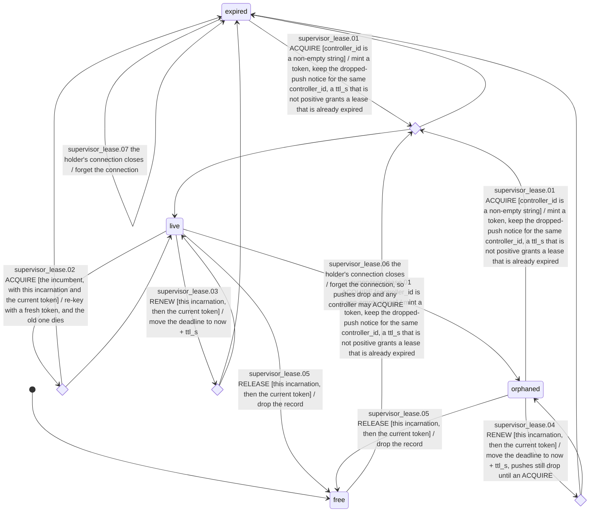

| Id | Source | Trigger | Guard | Effect | Target | Cite | Mark |
| --- | --- | --- | --- | --- | --- | --- | --- |
| supervisor_lease.01 | expired, free, orphaned | ACQUIRE | controller_id is a non-empty string | mint a token, keep the dropped-push notice for the same controller_id, a ttl_s that is not positive grants a lease that is already expired | expired, live | supervisor-protocol ss5 lease verbs, DL-79, DL-150 |  |
| supervisor_lease.02 | live | ACQUIRE | the incumbent, with this incarnation and the current token | re-key with a fresh token, and the old one dies | expired, live | supervisor-protocol ss5 lease verbs, DL-79, DL-80 |  |
| supervisor_lease.03 | live | RENEW | this incarnation, then the current token | move the deadline to now + ttl_s | expired, live | supervisor-protocol ss5 lease verbs, DL-150 |  |
| supervisor_lease.04 | orphaned | RENEW | this incarnation, then the current token | move the deadline to now + ttl_s, pushes still drop until an ACQUIRE | expired, orphaned | supervisor-protocol ss5 lease verbs, DL-150 |  |
| supervisor_lease.05 | live, orphaned | RELEASE | this incarnation, then the current token | drop the record | free | supervisor-protocol ss5 lease verbs, DL-150 |  |
| supervisor_lease.06 | live | the holder's connection closes |  | forget the connection, so pushes drop and any controller may ACQUIRE | orphaned | supervisor-protocol ss5 lease verbs, DL-150 |  |
| supervisor_lease.07 | expired | the holder's connection closes |  | forget the connection | expired | supervisor-protocol ss5 lease verbs |  |

## supervisor_client

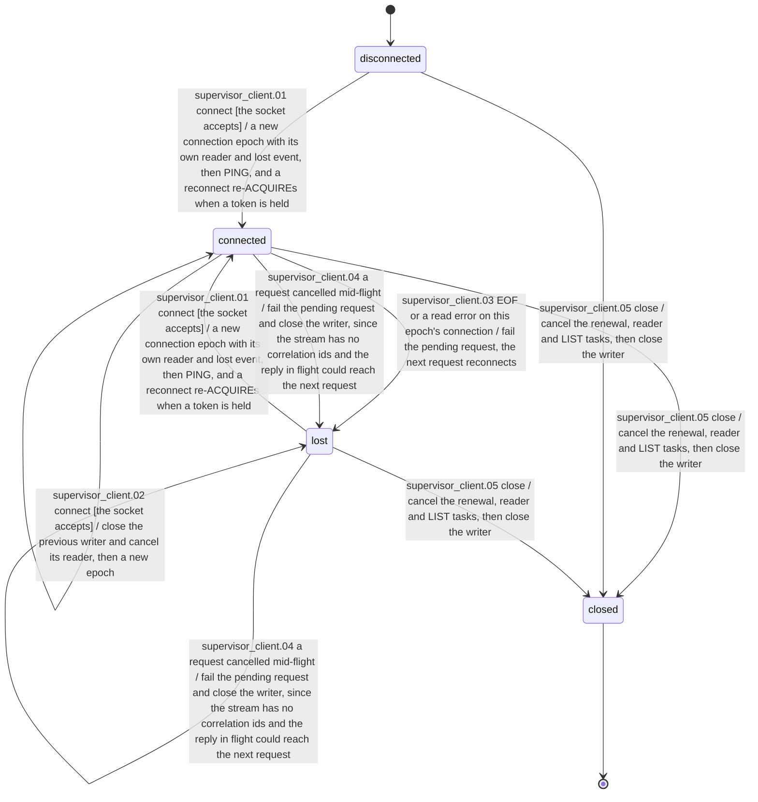

| Id | Source | Trigger | Guard | Effect | Target | Cite | Mark |
| --- | --- | --- | --- | --- | --- | --- | --- |
| supervisor_client.01 | disconnected, lost | connect | the socket accepts | a new connection epoch with its own reader and lost event, then PING, and a reconnect re-ACQUIREs when a token is held | connected | supervisor-protocol ss5, DL-48, DL-79 |  |
| supervisor_client.02 | connected | connect | the socket accepts | close the previous writer and cancel its reader, then a new epoch | connected | DL-48 |  |
| supervisor_client.03 | connected | EOF or a read error on this epoch's connection |  | fail the pending request, the next request reconnects | lost | supervisor-protocol ss5, runner-design ss7, DL-48 |  |
| supervisor_client.04 | connected, lost | a request cancelled mid-flight |  | fail the pending request and close the writer, since the stream has no correlation ids and the reply in flight could reach the next request | lost | DL-48 |  |
| supervisor_client.05 | connected, disconnected, lost | close |  | cancel the renewal, reader and LIST tasks, then close the writer | closed | DL-48 |  |

## host

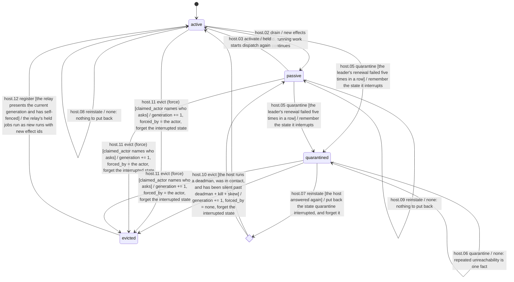

| Id | Source | Trigger | Guard | Effect | Target | Cite | Mark |
| --- | --- | --- | --- | --- | --- | --- | --- |
| host.01 | active | activate |  | none: the row does not move and no revision moves | active | concurrency-model ss8 |  |
| host.02 | active | drain |  | new effects are held, running work continues | passive | concurrency-model ss8, CM-13 |  |
| host.03 | passive | activate |  | held starts dispatch again | active | concurrency-model ss8 |  |
| host.04 | passive | drain |  | none: the row does not move and no revision moves | passive | concurrency-model ss8 |  |
| host.05 | active, passive | quarantine | the leader's renewal failed five times in a row | remember the state it interrupts | quarantined | concurrency-model ss7, ss8, DL-97, DL-291 |  |
| host.06 | quarantined | quarantine |  | none: repeated unreachability is one fact | quarantined | DL-97 |  |
| host.07 | quarantined | reinstate | the host answered again | put back the state quarantine interrupted, and forget it | active, passive | concurrency-model ss8, DL-97 |  |
| host.08 | active | reinstate |  | none: nothing to put back | active | concurrency-model ss8, DL-111 |  |
| host.09 | passive | reinstate |  | none: nothing to put back | passive | concurrency-model ss8, DL-111 |  |
| host.10 | quarantined | evict | the host runs a deadman, was in contact, and has been silent past deadman + kill + skew | generation += 1, forced_by = none, forget the interrupted state | evicted | concurrency-model ss8 preconditions 1-3, DL-151 |  |
| host.11 | active, passive, quarantined | evict (force) | claimed_actor names who asks | generation += 1, forced_by = the actor, forget the interrupted state | evicted | concurrency-model ss8, DL-111, DL-151 |  |
| host.12 | evicted | register | the relay presents the current generation and has self-fenced | the relay's held jobs run as new runs with new effect ids | active | concurrency-model ss8 (eviction is fenced on return), period-model ss3.3 | spec-only |

## admission

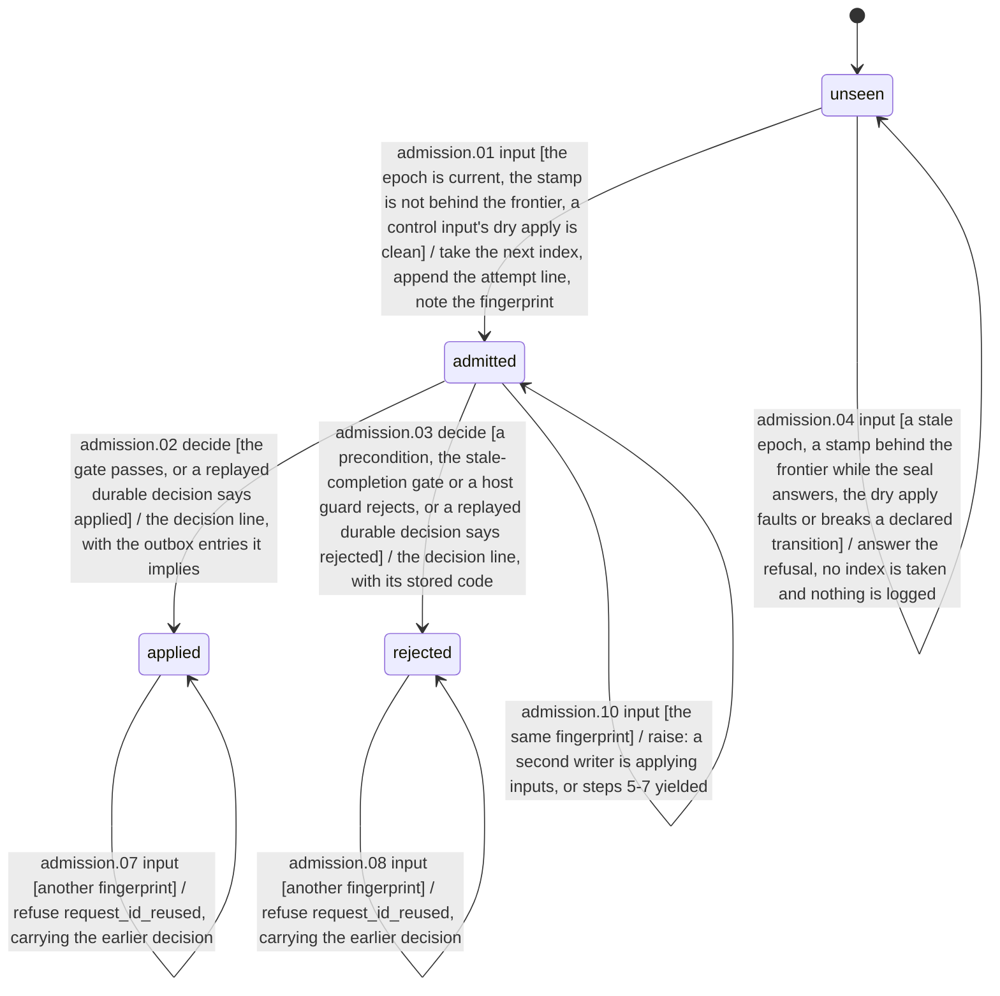

| Id | Source | Trigger | Guard | Effect | Target | Cite | Mark |
| --- | --- | --- | --- | --- | --- | --- | --- |
| admission.01 | unseen | input | the epoch is current, the stamp is not behind the frontier, a control input's dry apply is clean | take the next index, append the attempt line, note the fingerprint | admitted | concurrency-model ss4 steps 2-4, DL-292 |  |
| admission.02 | admitted | decide | the gate passes, or a replayed durable decision says applied | the decision line, with the outbox entries it implies | applied | concurrency-model ss4 steps 5-7, DL-118 |  |
| admission.03 | admitted | decide | a precondition, the stale-completion gate or a host guard rejects, or a replayed durable decision says rejected | the decision line, with its stored code | rejected | concurrency-model ss4, DL-235, DL-272 |  |
| admission.04 | unseen | input | a stale epoch, a stamp behind the frontier while the seal answers, the dry apply faults or breaks a declared transition | answer the refusal, no index is taken and nothing is logged | unseen | concurrency-model ss4 steps 2-3, DL-90, DL-274, DL-292 |  |
| admission.05 | applied | input | the same fingerprint | answer the stored decision, no index, no clock | applied | concurrency-model ss4 step 2, CM-05 |  |
| admission.06 | rejected | input | the same fingerprint | answer the stored decision and its code, no index, no clock | rejected | concurrency-model ss4 step 2, CM-05, DL-272 |  |
| admission.07 | applied | input | another fingerprint | refuse request_id_reused, carrying the earlier decision | applied | concurrency-model ss4 step 2, DL-217 |  |
| admission.08 | rejected | input | another fingerprint | refuse request_id_reused, carrying the earlier decision | rejected | concurrency-model ss4 step 2, DL-217 |  |
| admission.09 | admitted | input | another fingerprint | refuse request_id_reused, with no decision to carry | admitted | concurrency-model ss4 step 2, DL-217 |  |
| admission.10 | admitted | input | the same fingerprint | raise: a second writer is applying inputs, or steps 5-7 yielded | admitted | concurrency-model ss4 step 2 |  |

## effect

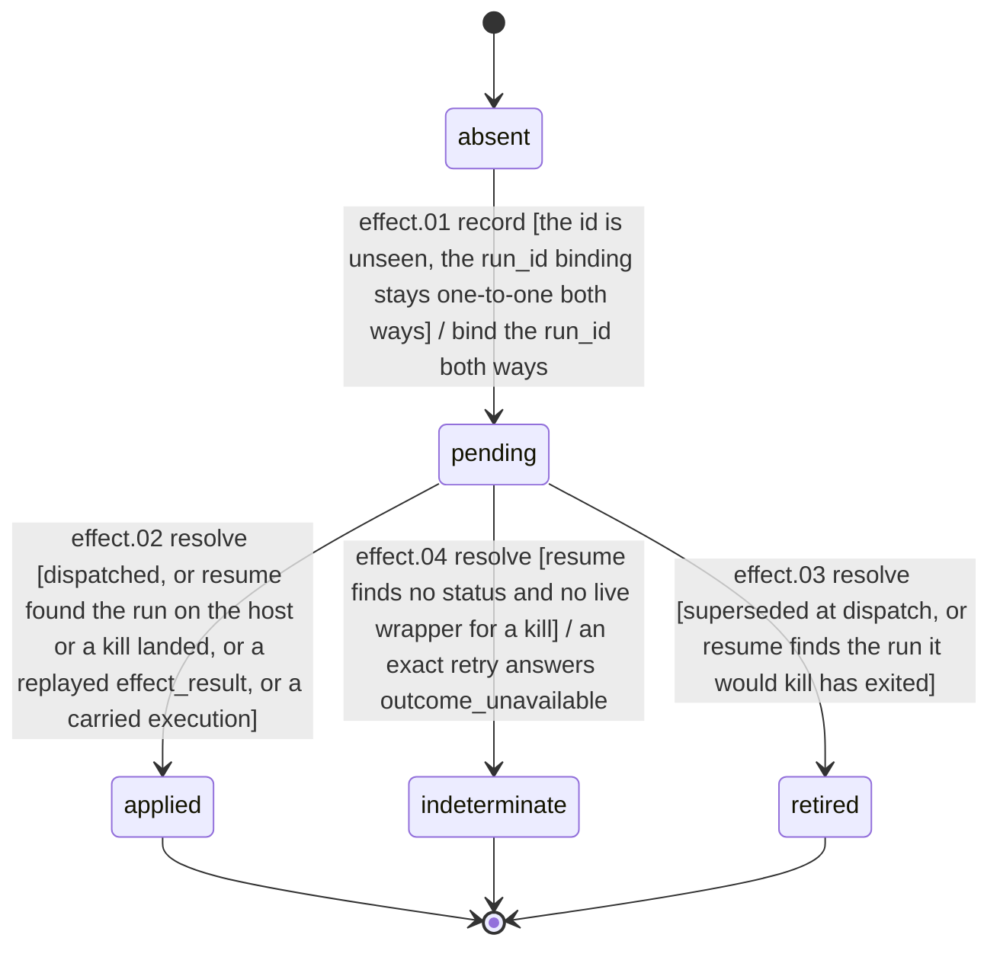

| Id | Source | Trigger | Guard | Effect | Target | Cite | Mark |
| --- | --- | --- | --- | --- | --- | --- | --- |
| effect.01 | absent | record | the id is unseen, the run_id binding stays one-to-one both ways | bind the run_id both ways | pending | concurrency-model ss4 step 7, ss5, DL-96, DL-118 |  |
| effect.02 | pending | resolve | dispatched, or resume found the run on the host or a kill landed, or a replayed effect_result, or a carried execution |  | applied | concurrency-model ss5, DL-96, period-model ss3.5 |  |
| effect.03 | pending | resolve | superseded at dispatch, or resume finds the run it would kill has exited |  | retired | concurrency-model ss5, DL-111, DL-232 |  |
| effect.04 | pending | resolve | resume finds no status and no live wrapper for a kill | an exact retry answers outcome_unavailable | indeterminate | concurrency-model ss5, CM-06, DL-111 |  |

## subscription

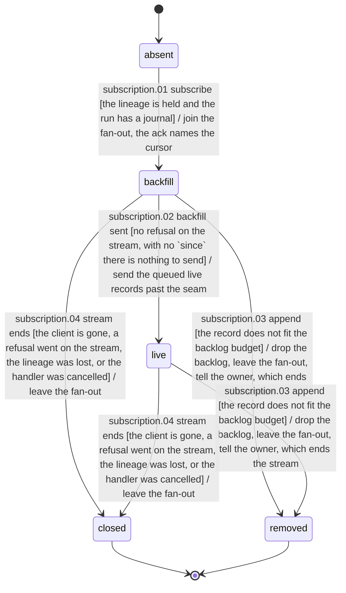

| Id | Source | Trigger | Guard | Effect | Target | Cite | Mark |
| --- | --- | --- | --- | --- | --- | --- | --- |
| subscription.01 | absent | subscribe | the lineage is held and the run has a journal | join the fan-out, the ack names the cursor | backfill | control-protocol ss5, DL-45, DL-267 |  |
| subscription.02 | backfill | backfill sent | no refusal on the stream, with no `since` there is nothing to send | send the queued live records past the seam | live | control-protocol ss5, DL-45, DL-135 |  |
| subscription.03 | backfill, live | append | the record does not fit the backlog budget | drop the backlog, leave the fan-out, tell the owner, which ends the stream | removed | control-protocol ss5, DL-267 |  |
| subscription.04 | backfill, live | stream ends | the client is gone, a refusal went on the stream, the lineage was lost, or the handler was cancelled | leave the fan-out | closed | control-protocol ss5, PR-03, period-model ss11 |  |

## seal_boundary

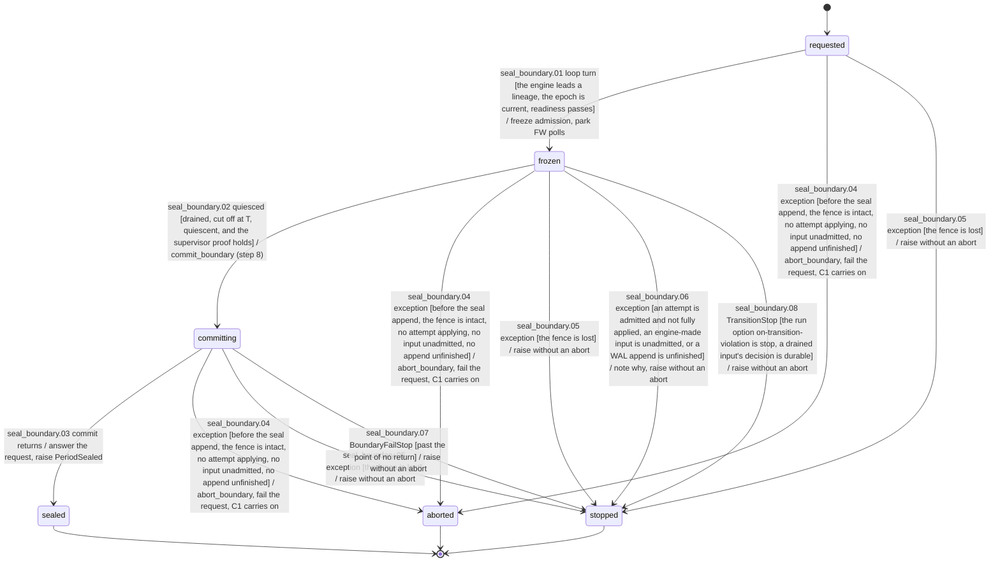

| Id | Source | Trigger | Guard | Effect | Target | Cite | Mark |
| --- | --- | --- | --- | --- | --- | --- | --- |
| seal_boundary.01 | requested | loop turn | the engine leads a lineage, the epoch is current, readiness passes | freeze admission, park FW polls | frozen | period-model ss6 step 2, ss8, PR-28c |  |
| seal_boundary.02 | frozen | quiesced | drained, cut off at T, quiescent, and the supervisor proof holds | commit_boundary (step 8) | committing | period-model ss6 steps 3-8, PR-27 |  |
| seal_boundary.03 | committing | commit returns |  | answer the request, raise PeriodSealed | sealed | period-model ss7 |  |
| seal_boundary.04 | committing, frozen, requested | exception | before the seal append, the fence is intact, no attempt applying, no input unadmitted, no append unfinished | abort_boundary, fail the request, C1 carries on | aborted | period-model ss7, PR-28b |  |
| seal_boundary.05 | committing, frozen, requested | exception | the fence is lost | raise without an abort | stopped | period-model ss7, DL-101, PR-28b |  |
| seal_boundary.06 | frozen | exception | an attempt is admitted and not fully applied, an engine-made input is unadmitted, or a WAL append is unfinished | note why, raise without an abort | stopped | DL-274 |  |
| seal_boundary.07 | committing | BoundaryFailStop | past the point of no return | raise without an abort | stopped | period-model ss7 |  |
| seal_boundary.08 | frozen | TransitionStop | the run option on-transition-violation is stop, a drained input's decision is durable | raise without an abort | stopped | concurrency-model ss4, DL-292 |  |
