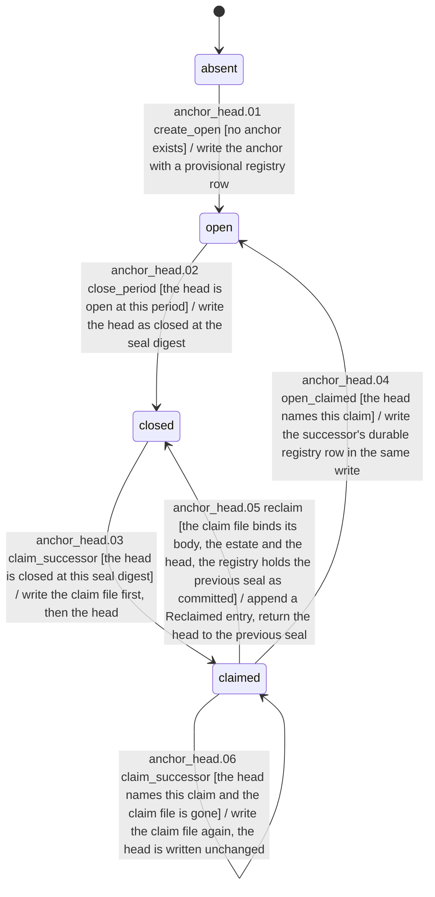
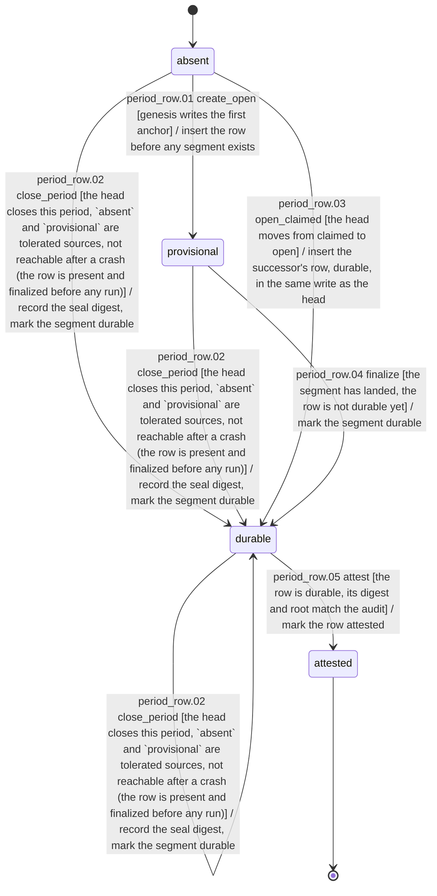

# State machines

This file is generated from `dsl41.machines`; regenerate it with `uv run python scripts/render_state_machines.py`.

## anchor_head

| Id | Source | Trigger | Guard | Effect | Target | Cite | Mark |
| --- | --- | --- | --- | --- | --- | --- | --- |
| anchor_head.01 | absent | create_open | no anchor exists | write the anchor with a provisional registry row | open | period-model ss1.1, ss1.3 |  |
| anchor_head.02 | open | close_period | the head is open at this period | write the head as closed at the seal digest | closed | period-model ss1.3, ss3 |  |
| anchor_head.03 | closed | claim_successor | the head is closed at this seal digest | write the claim file first, then the head | claimed | period-model ss1.3 |  |
| anchor_head.04 | claimed | open_claimed | the head names this claim | write the successor's durable registry row in the same write | open | period-model ss1.3, PR-02c |  |
| anchor_head.05 | claimed | reclaim | the claim file binds its body, the estate and the head, the registry holds the previous seal as committed | append a Reclaimed entry, return the head to the previous seal | closed | period-model ss1.3 |  |
| anchor_head.06 | claimed | claim_successor | the head names this claim and the claim file is gone | write the claim file again, the head is written unchanged | claimed | period-model ss1.3 |  |

## period_row

| Id | Source | Trigger | Guard | Effect | Target | Cite | Mark |
| --- | --- | --- | --- | --- | --- | --- | --- |
| period_row.01 | absent | create_open | genesis writes the first anchor | insert the row before any segment exists | provisional | period-model ss1.3, PR-02c |  |
| period_row.02 | absent, durable, provisional | close_period | the head closes this period, `absent` and `provisional` are tolerated sources, not reachable after a crash (the row is present and finalized before any run) | record the seal digest, mark the segment durable | durable | period-model ss1.3, ss3 |  |
| period_row.03 | absent | open_claimed | the head moves from claimed to open | insert the successor's row, durable, in the same write as the head | durable | period-model ss1.3, PR-02c |  |
| period_row.04 | provisional | finalize | the segment has landed, the row is not durable yet | mark the segment durable | durable | period-model ss1.3 |  |
| period_row.05 | durable | attest | the row is durable, its digest and root match the audit | mark the row attested | attested | period-model ss1.3, ss11 |  |
